# Kiến trúc hệ thống — GreenBin AI (VHR-17)

> **Agent Phân loại Rác & Điều phối Thu gom Tái chế** — mã đề VHR-17, nhóm T-075,
> AI20K Build Phase Cohort 3.
>
> Tài liệu này là **deliverable #3 (Architecture diagram)**. Nó mô tả hệ thống
> *như đang có trong repo này*, không phải hệ thống mong muốn. Chỗ nào chưa làm
> thì ghi thẳng là chưa làm — xem mục 21.
>
> **Cập nhật:** 16/08/2026 · 

---

## Mục lục

| # | Mục | # | Mục |
|---|---|---|---|
| 1 | [Số liệu chốt](#1-số-liệu-chốt) | 12 | [Luồng D — thùng thu gom](#12-luồng-d--thùng-thu-gom-thông-minh) |
| 2 | [Bài toán và 3 vai trò](#2-bài-toán-và-ba-vai-trò) | 13 | [Mô hình dữ liệu](#13-mô-hình-dữ-liệu-23-bảng) |
| 3 | [Nguyên tắc kiến trúc](#3-sáu-nguyên-tắc-kiến-trúc) | 14 | [Bề mặt API và phân quyền](#14-bề-mặt-api-và-phân-quyền) |
| 4 | [Sơ đồ ngữ cảnh](#4-sơ-đồ-ngữ-cảnh-c4--mức-1) | 15 | [Quyền riêng tư ảnh](#15-quyền-riêng-tư-ảnh) |
| 5 | [Sơ đồ container](#5-sơ-đồ-container-c4--mức-2) | 16 | [Quan sát và đo đạc](#16-quan-sát-và-đo-đạc) |
| 6 | [Thành phần backend](#6-thành-phần-backend-c4--mức-3) | 17 | [Xử lý lỗi và suy giảm](#17-xử-lý-lỗi-và-suy-giảm-có-kiểm-soát) |
| 7 | [Luồng A — phân loại](#7-luồng-a--phân-loại-rác-đường-găng) | 18 | [Kiến trúc frontend](#18-kiến-trúc-frontend) |
| 8 | [Định tuyến 4 tầng](#8-định-tuyến-model-bốn-tầng) | 19 | [Triển khai và CI/CD](#19-triển-khai-và-cicd) |
| 9 | [Agent LangGraph](#9-agent-langgraph) | 20 | [Ánh xạ tiêu chí chấm và PLO](#20-ánh-xạ-tiêu-chí-chấm-và-plo) |
| 10 | [Guardrails và HITL](#10-guardrails-và-ba-điểm-hitl) | 21 | [Giới hạn và nợ kỹ thuật](#21-giới-hạn-đã-biết-và-nợ-kỹ-thuật) |
| 11 | [Luồng B/C — RAG, thu gom](#11-luồng-b-và-c--tra-quy-định-và-điều-phối-tuyến) | 22 | [Chỉ mục ADR](#22-chỉ-mục-adr) |

---

## 1. Số liệu chốt

Đo trực tiếp, không ước lượng. **Cập nhật 18/08/2026.**

```
pytest -q                              → 971 passed
ruff check src/ tests/ eval/ scripts/  → All checks passed!
số route khai báo                      → 80 (gồm cả WebSocket theo dõi xe)
frontend: npm run lint                 → 0 lỗi
frontend: npm --prefix frontend run typecheck → sạch
```

| Chỉ số | Giá trị | Bản 16/08 |
|---|---|---|
| Mã Python | **91 file** trong `src/` | 76 |
| Mã test | **113 file** trong `tests/` — **971 ca** | 93 file · 791 ca |
| Bảng CSDL | **28** | 26 |
| Endpoint HTTP | **80 route** (nghiệp vụ dưới `/api/v1` + `/health` + WebSocket) | 69 |
| Vai trò người dùng | 3 · **19 quyền** trong ma trận | không đổi |
| Điểm HITL | 3 | không đổi |
| Tầng định tuyến model | 4 (T0 · T0.5 · T1 · T2) | không đổi |
| Nhà cung cấp model đấu nối | 5 + 1 local (Gemini · OpenAI · OpenRouter · NVIDIA · Groq · CLIP ONNX) | không đổi |

Bước nhảy 791 → 971 ca test và 69 → 80 route đến từ ba việc: **gộp nhánh phần cứng
của nhóm** vào nhánh triển khai (thêm firmware ESP32, tài liệu IoT, đường
`/iot/captures`), **đóng lát cắt dọc thiết bị** (mục 12.1), và **thêm luồng phiên bỏ
rác tại thùng** (mục 12.2). Hai bảng mới là `phien_thung` và `token_thiet_bi`.

Ba quyền thêm sau bản 06/08: `view_diem_gui` (cư dân xem điểm gửi),
`edit_own_profile` (tự sửa hồ sơ), `assign_bin` (quản lý giao thùng cho nhân
viên). Ma trận quyền ở `src/services/auth.py` là **bản chép lại** của bảng trong
`docs/FRONTEND_SPEC.md` mục 1 — sửa một bên thì phải sửa cả hai, và **ba quyền
này chưa được chép sang spec**, đang nợ.

---

## 2. Bài toán và ba vai trò

BQL toà nhà **có nghĩa vụ pháp lý** phân loại rác tại nguồn (Luật BVMT 2020,
NĐ 45/2022). Thực tế việc đó dồn hết lên đội vệ sinh: họ bới lại toàn bộ rác
bằng tay, kể cả pin và rác nguy hại cư dân vứt lẫn. Đăng ký và điều phối thu gom
đồ cồng kềnh vẫn làm thủ công qua tin nhắn.

GreenBin AI là **lớp vận hành** đặt lên trên việc đó. Nguyên tắc xuyên suốt
([ADR-0002](docs/decisions/0002-chuyen-trong-tam-sang-van-hanh.md)):

> **Mỗi kết quả AI phải sinh ra một hành động hoặc một bản ghi trong hệ thống.**
> Không được dừng ở một màn hình trả lời.

| Vai trò | Người thật là ai | Làm gì trong hệ thống |
|---|---|---|
| `resident` | Cư dân | Chụp/mô tả rác · đăng ký thu gom đồ cồng kềnh · xem lịch · xem ảnh mình đã bị xoá gì |
| `cleaner` | Đội vệ sinh tại phòng rác tầng | Phân loại tại chỗ tập kết · **xác nhận nhãn** (HITL #2) · chạy tuyến · đánh dấu điểm dừng xong · xem bản đồ thùng |
| `manager` | Ban quản lý / đơn vị thu gom | **Duyệt yêu cầu vượt ngưỡng** (HITL #1) · **duyệt tuyến agent đề xuất** (HITL #3) · sửa danh mục · xem Vận hành, Chất lượng AI, Agent Run · xem ảnh gốc (có ghi log) |

**Phạm vi rác đi qua AI** ([ADR-0003](docs/decisions/0003-phan-tang-rac-va-trong-tam-doi-ve-sinh.md)):
chỉ **luồng B** — tái chế, cồng kềnh, nguy hại. Luồng A (rác ướt đóng túi nilon
đục) **nằm ngoài phạm vi có chủ đích**: vision không nhìn xuyên túi, và nhãn của
nó không ai tranh chấp.

---

## 3. Sáu nguyên tắc kiến trúc

Mỗi nguyên tắc dưới đây đều đọc được thành code cụ thể, không phải khẩu hiệu.

| # | Nguyên tắc | Thể hiện trong code |
|---|---|---|
| 1 | **Không chắc thì không trả lời** | `_refuse()` xoá luôn nhãn và hướng dẫn, chỉ giữ lại "phỏng đoán" có dán nhãn — `classifier.py:127` |
| 2 | **Rẻ trước, đắt sau** | 4 tầng: cache pHash → CLIP local → T1 → T2. Hai tầng đầu $0 |
| 3 | **Mất một nguồn chỉ mất một tầng** | Provider khai riêng từng tầng `VISION_PROVIDER_T1/_T2/_TEXT`; T1 hỏng thì T2 cứu ([ADR-0006](docs/decisions/0006-provider-theo-tung-tang.md)) |
| 4 | **Con số phải đo, không được đoán** | `price_known=False` khi nhà cung cấp không công bố giá → UI hiện "chưa có giá" thay vì "$0" |
| 5 | **Người quyết định việc rủi ro** | 3 điểm HITL, lý do từ chối chọn từ danh sách cố định để chảy ngược vào tập cải tiến |
| 6 | **Đường không đi cũng phải nhìn thấy** | Nhánh `skip_*` của graph vẫn ghi `RunNodeMetric` với `status="skipped"` kèm lý do |

---

## 4. Sơ đồ ngữ cảnh (C4 — mức 1)

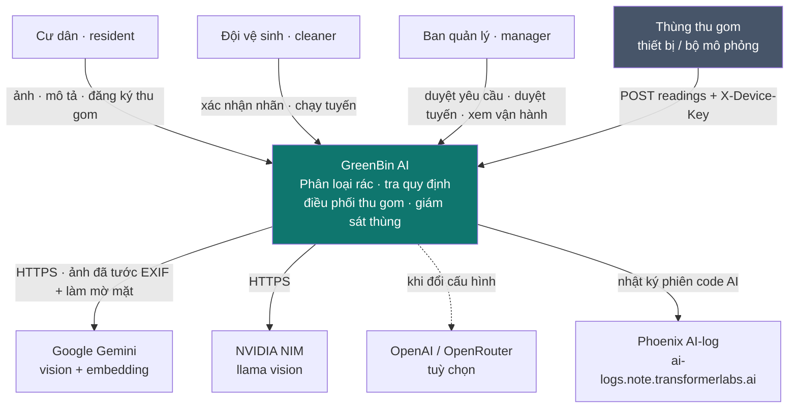

**Điểm cần nhớ:** ảnh **không bao giờ** rời máy chủ ở dạng gốc. Mọi mũi tên đi ra
nhà cung cấp model đều mang ảnh đã tước EXIF, làm mờ mặt, nén 512px — xem mục 15.

---

## 5. Sơ đồ container (C4 — mức 2)

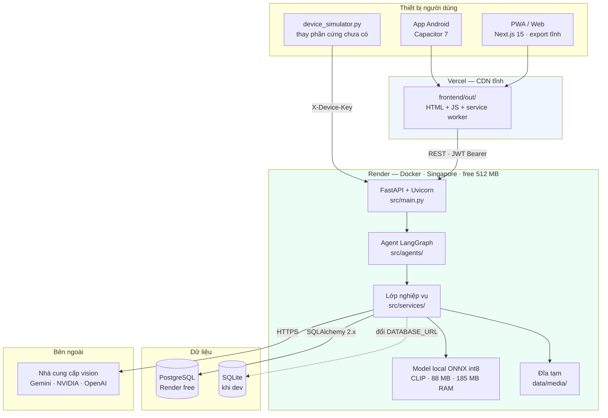

**Vì sao tách Vercel / Render:** `output: "export"` cho ra thư mục `out/` tĩnh
thuần. Cùng một thư mục đó vừa để Vercel phục vụ, vừa để Capacitor đóng gói APK,
vừa để service worker cache — một bản build dùng cho ba kênh phân phối
([ADR-0005](docs/decisions/0005-pwa-va-capacitor-thay-vi-viet-lai-native.md)).
Đây là lý do màn `/dieu-phoi` **không được** đổi sang TanStack Start dù bản thiết
kế Lovable viết bằng nó.

---

## 6. Thành phần backend (C4 — mức 3)

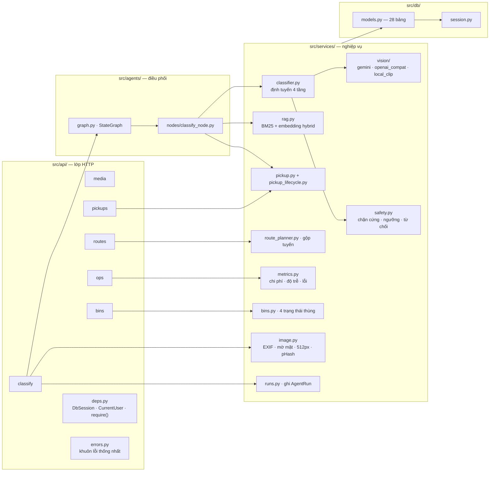

**Quy tắc phân tầng được giữ nghiêm:** router **không** chứa logic nghiệp vụ, chỉ
nối HTTP ↔ service. Ngược lại `pickup_lifecycle.py` là module **thuần** — không
import gì từ `src.db`, test được mà không cần session.

---

## 7. Luồng A — phân loại rác (đường găng)

Đây là luồng quan trọng nhất, cũng là luồng demo chính.

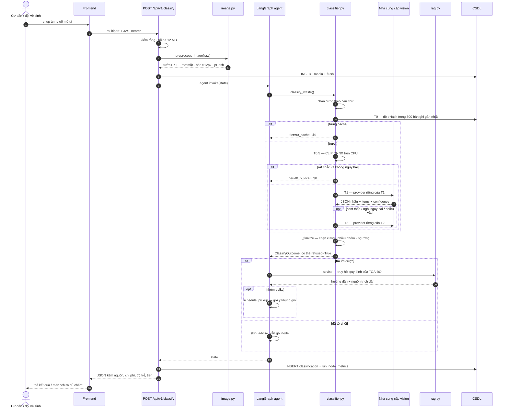

**Ba chi tiết dễ bỏ sót:**

1. **Tiền xử lý đứng trước mọi lệnh gọi model** — không có đường tắt nào bỏ qua
   `preprocess_image`. Điều này được khẳng định bằng test.
2. **`refused=True` là kết quả hợp lệ, không phải lỗi.** Nó vẫn ghi bản ghi, vẫn
   đẩy vào hàng đợi HITL #2, vẫn tính vào chỉ số.
3. `classify_waste` nhận **ảnh đã xử lý**, không bao giờ nhận ảnh gốc — ghi rõ
   trong docstring của hàm.

---

## 8. Định tuyến model bốn tầng

Đây là điểm ăn PLO 1 và là phần trả lời ràng buộc "tối ưu chi phí" của đề.

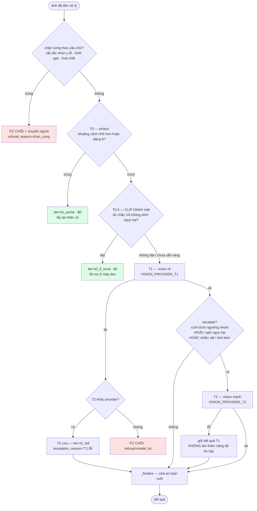

| Tầng | Chạy ở đâu | Dùng khi | Chi phí | Độ trễ đo được |
|---|---|---|---|---|
| **T0** cache pHash | CSDL | ảnh trùng/gần trùng đã phân loại | **$0** | vài ms |
| **T0.5** CLIP ONNX int8 | CPU máy chủ | rất chắc **và** không dính nhóm nguy hại | **$0** | 56 ms dev · **2.595 ms trên Render** |
| **T1** vision rẻ | NVIDIA `llama-3.2-90b-vision` | phần lớn lưu lượng | credit | 10–28 s |
| **T2** vision mạnh | Gemini flash | conf thấp · **nghi nguy hại** · nhiều vật | quota 20 req/ngày | p95 ~40 s trên deploy |

**Ba quyết định kiến trúc nằm trong bảng này:**

- **Escalate lên T2 phải gồm cả "nghi rác nguy hại", không chỉ confidence thấp.**
  Một model tự tin sai về cục pin nguy hiểm hơn một model lưỡng lự.
- **T0.5 không bao giờ được chốt nhãn nhóm nguy hại** (`local_never_decides_hazardous=True`).
  Model rẻ có quyền nói "chắc chắn là chai nhựa", không có quyền nói "chắc chắn
  không phải pin".
- **Mỗi tầng một nhà cung cấp riêng.** Free tier Gemini chỉ 20 request/ngày, mỗi
  lần chụp tiêu 2 → dồn cả hệ thống vào một nguồn thì 10 lần chụp là đứng máy
  ([ADR-0006](docs/decisions/0006-provider-theo-tung-tang.md)).

> ⚠️ **Con số trong báo cáo phải là con số đo trên deploy.** Render free chỉ có
> ~0,1 CPU chia sẻ: CLIP chạy 56 ms ở máy dev thành 2.595 ms trên Render —
> **chậm 46 lần**. Đừng bao giờ mang số của máy dev lên slide.

---

## 9. Agent LangGraph

### 9.1 Hình dạng graph

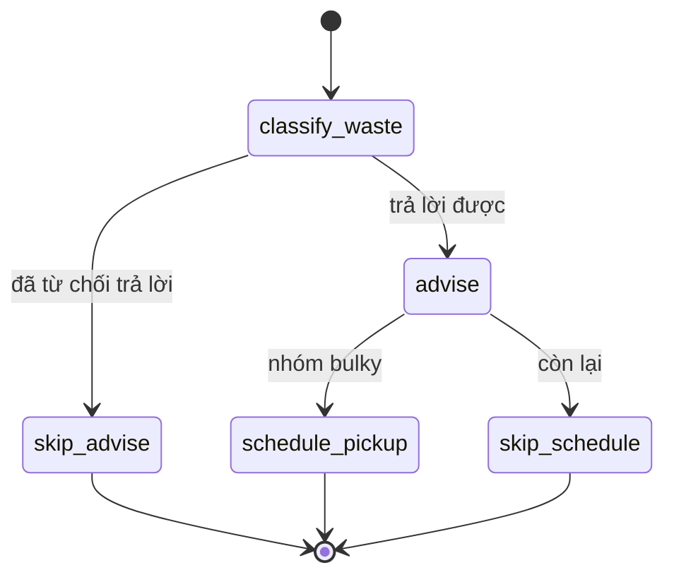

Hai nhánh `skip_*` tồn tại **có chủ đích**, không phải cho đẹp sơ đồ: chúng vẫn
sinh `RunNodeMetric` với `status="skipped"` kèm lý do, nên màn Agent Run hiện
được **cả đường đã đi lẫn đường không đi** — đúng yêu cầu "trace và debug được"
của chương trình.

Hình dạng graph còn được xuất ra hằng `GRAPH_SHAPE` trong `agents/graph.py` để
frontend vẽ đúng sơ đồ đó — **một nguồn sự thật** cho cả hai phía.

### 9.2 State

```python
class GreenBinState(TypedDict, total=False):
    # đầu vào
    session, image_bytes, image_phash, text_query, building_id, user_id
    # kết quả từng node — node sau đọc kết quả node trước rồi bồi thêm
    outcome: ClassifyOutcome
    advice: AdviceResult
    schedule_hint: dict
    # vận hành
    nodes: list[NodeMetric]
    error: str
```

Đây chính là thứ làm workflow "có trạng thái" theo đúng nghĩa của chương trình:
state đi qua `classify → advise → schedule`, và toàn bộ hành trình ghi lại được
trong `nodes` để dựng lại màn Agent Run sau này.

### 9.3 Các node ghi lại

Mỗi bước — kể cả bước không gọi model — đều sinh một `NodeMetric`:

| `node` | Ghi lại gì |
|---|---|
| `safety_precheck` | có trúng luật chặn cứng không |
| `cache_lookup` | trúng/trượt · `phash_distance` · id bản ghi nguồn |
| `local_model` | confidence · ngưỡng · có chốt nhãn không · **có bị chặn vì nghi nguy hại không** |
| `classify_waste` | tier · provider · model · token vào/ra · token ảnh · chi phí |
| `classify_waste_t2` | lý do escalate · confidence mới · hoặc lỗi của T2 |
| `safety_check` | luật chặn cứng lần cuối · số luật đang áp |
| `advise` / `skip_advise` | nguồn đã truy hồi · chế độ hybrid hay thuần BM25 |
| `schedule_pickup` / `skip_schedule` | gợi ý khung giờ · hoặc lý do bỏ qua |

---

## 10. Guardrails và ba điểm HITL

### 10.1 Cửa an toàn cuối — `_finalize()`

Thứ tự **là một phần của thiết kế**, không phải ngẫu nhiên:

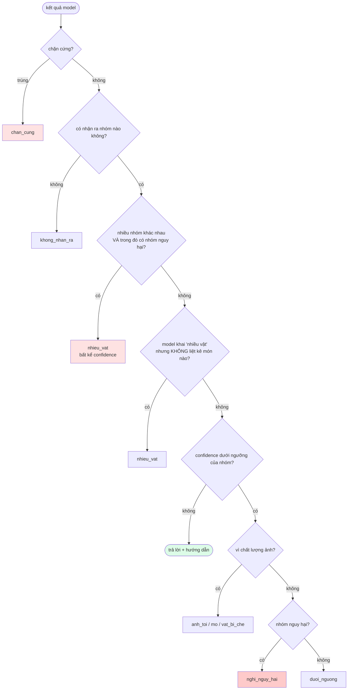

**Vì sao chặn cứng đứng trước:** nó **bỏ qua confidence hoàn toàn**. Bình gas thì
model có tự tin 99% cũng không được phép hướng dẫn.

**Vì sao "nhiều nhóm" kiểm trước ngưỡng:** bước so ngưỡng chỉ chạy khi confidence
thấp. Đặt sau sẽ bỏ lọt đúng ca nguy hiểm nhất — ảnh có cả bình giữ nhiệt lẫn củ
sạc, model tự tin 0,85 về bình giữ nhiệt và **âm thầm bỏ qua cục sạc**. Đây là
failure case thật, bản ghi id 185 trên deploy.

**Từ chối ≠ vô dụng.** Khi từ chối, hệ thống vẫn hiện phỏng đoán nhưng **dán nhãn
rõ là phỏng đoán và không kèm hướng dẫn xử lý**. Đó là ranh giới giữa "thận
trọng" và "vô dụng".

### 10.2 Ba điểm HITL

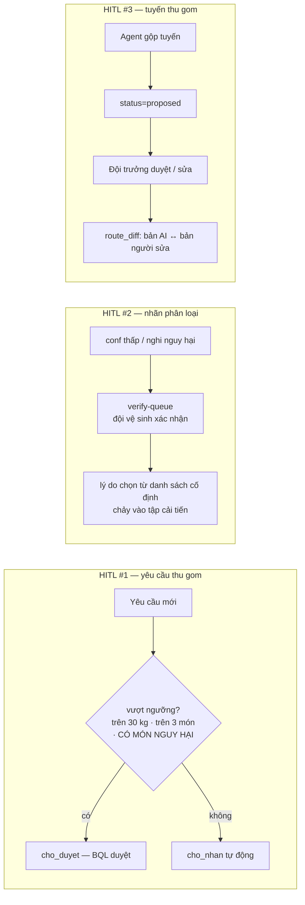

**HITL #3 là điểm quan trọng nhất về mặt nguyên tắc:** agent **không được tự đổi
lịch làm việc của người**. Tuyến do agent đề xuất luôn ra đời ở trạng thái
`proposed`, và `route_diff()` cho phép so bản AI đề xuất với bản người đã sửa —
vừa là guardrail vừa là nguồn dữ liệu cải tiến.

**Nhóm nguy hại luôn cần người duyệt bất kể khối lượng** — nhóm đó có quy trình
xử lý riêng, không đi cùng chuyến đồ cồng kềnh.

---

## 11. Luồng B và C — tra quy định và điều phối tuyến

### 11.1 RAG hybrid (`advise`)

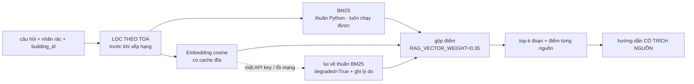

Ba điểm khiến phần này **vượt naive RAG** (PLO 3):

1. **Hybrid thật** — BM25 chạy thuần Python nên hệ thống vẫn truy hồi được khi
   chưa có API key; embedding chỉ là phần cộng thêm.
2. **Lọc theo toà trước khi xếp hạng** — quy định mỗi toà mỗi khác, trộn tài liệu
   toà khác vào là *trả lời sai*, không phải "hơi lệch".
3. **Đo được.** Trên 18 câu ở `eval/retrieval_questions.py`:

   | Chỉ số | BM25 thuần | Hybrid |
   |---|---|---|
   | hit@1 | 0,667 | **0,722** |
   | hit@5 | 0,944 | **1,000** |
   | MRR | 0,792 | **0,838** |

   > Dùng hit@k + MRR **thay cho precision@5**: mỗi câu chỉ có 1–2 đoạn đúng nên
   > precision@5 trần cứng ở 0,2–0,4, đọc lên gây hiểu nhầm là hệ thống dở.

**Mọi câu trả lời đều phải chỉ ra được nguồn.** Khối UI nào đưa kết luận mà không
có đường dẫn về văn bản gốc là khối thiết kế sai.

### 11.2 Gộp tuyến (`route_planner.py`)

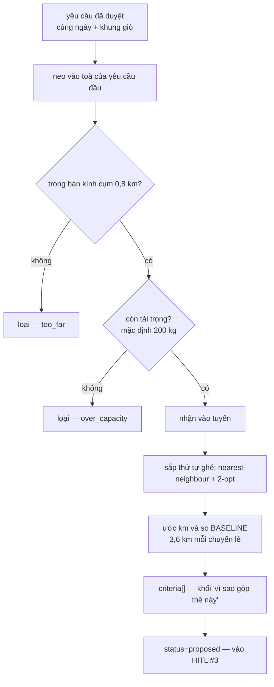

**Có chủ đích không dùng OR-Tools.** VRP đầy đủ là cái bẫy nuốt hết thời gian mà
không thêm cột điểm nào; gộp theo cụm toà + khung giờ đã đủ tạo ra con số "tiết
kiệm bao nhiêu km" để đưa lên báo cáo. Điều bắt buộc phải có là khối `criteria[]`
giải thích **vì sao** gộp như vậy — quyết định của agent phải đọc được bởi người.

#### Thứ tự ghé điểm dừng — `toi_uu_tuyen.py` (10/08)

Bản trước xếp điểm dừng theo **tên toà rồi mã căn** — tức theo bảng chữ cái, một
thứ tự không liên quan gì tới quãng đường. Nay là **TSP đường mở**:
nearest-neighbour dựng thứ tự ban đầu, rồi 2-opt đảo từng đoạn con để gỡ các nét
cắt chéo, lặp tới khi một vòng quét trọn vẹn không cải thiện gì.

Ba ràng buộc thiết kế:

- **Đường mở, không đóng vòng.** `estimate_route_km` đã cộng riêng 1,2 km cố định
  cho chặng đi/về khỏi khu tập kết, nên hàm đo độ dài chỉ cộng các cặp liền kề.
- **Kết quả xác định.** Hoà thì chọn chỉ số nhỏ hơn — cùng đầu vào luôn cho cùng
  thứ tự, nếu không thì không ai kiểm chứng được gì.
- **Không biết gì về CSDL.** Module nhận một danh sách bất kỳ và một hàm đo
  khoảng cách, nên test được bằng điểm phẳng Euclid, không cần dựng CSDL.

Đo trên 100 bộ 7 điểm ngẫu nhiên, đối chiếu với vét cạn `7!`:

| | Tổng quãng đường | Đạt tối ưu tuyệt đối |
|---|---|---|
| Xếp theo bảng chữ cái (bản cũ) | 2189,8 | — |
| **Nearest-neighbour + 2-opt** | **1804,8 (−17,6%)** | **88/100 bộ** |

⚠️ **Không gọi đây là Dijkstra hay A\*.** Hai thuật toán đó trả lời câu hỏi "đi
từ A tới B đường nào" và cần đồ thị đường phố — thứ repo này không có. Câu hỏi ở
đây là "ghé N điểm theo thứ tự nào cho ngắn", đó là TSP/VRP.

Giới hạn còn lại: điểm ghé **đầu tiên** bị cố định vào phần tử đầu danh sách,
trong khi chặng đi/về là hằng số nên không có lý do gì phải cố định. Thả ra
(chạy nearest-neighbour từ cả N điểm đầu, lấy bản ngắn nhất) đo được thêm −6,3%
và lên 98/100 bộ tối ưu — đã ghi vào nợ kỹ thuật, chưa làm.

### 11.3 ⚠️ Hai bộ từ vựng trạng thái dùng chung ba từ

Đây là cạm bẫy nguy hiểm nhất của codebase hiện tại:

```
PickupRequest.status : pending · approved · scheduled · done · cancelled · rejected
PickupRoute.status   : proposed · approved · done · in_progress · cancelled
```

> 🚨 **Tìm-thay thế mù chuỗi `"approved"` trên cả repo sẽ phá state machine của
> tuyến đường, và test có thể không bắt được.** Danh sách các dòng thuộc về TUYẾN
> nằm trong comment ngay trên `TU_TRANG_THAI_CU` ở `src/services/pickup_lifecycle.py`.

Đang có một **cuộc di trú dở dang** sang máy trạng thái mới 10 bước:

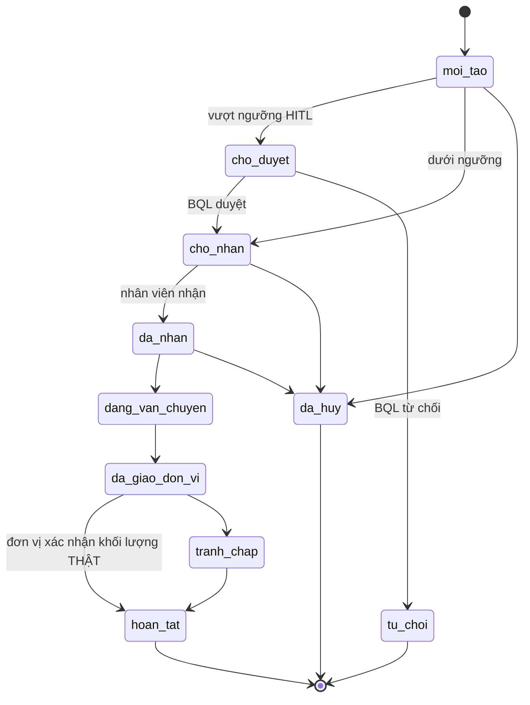

**Điểm thiết kế đáng chú ý:** một yêu cầu **chỉ tích điểm ở `hoan_tat`**, và
`hoan_tat` chỉ tới được qua `da_giao_don_vi` — nơi một người ở đơn vị thu gom xác
nhận khối lượng thật. Hệ thống **không bao giờ trao điểm dựa trên ước lượng khối
lượng của AI**.

Trạng thái di trú (tính tới 05/08): chỗ **đọc** đã lật xong, chỗ **ghi** còn
nguyên từ vựng cũ (`pickup.py:235,261,288` · `route_planner.py:280,291,321,423` ·
`routes.py:127` · default cột trong `models.py` · ~13 chỗ trong `seed.py`).
`chuan_hoa()` chịu **cả hai chiều** chính là để cho phép tình trạng dở dang này
chạy được.

---

## 12. Luồng D — thùng thu gom thông minh

Phần mới nhất, dựng trong phiên 05/08. Đây là chỗ **phần cứng vào phạm vi** —
nhưng chỉ với vai trò **nguồn dữ liệu cho phần mềm**, không làm cơ cấu phân loại
tự động (quyết định này còn nợ ADR-0009).

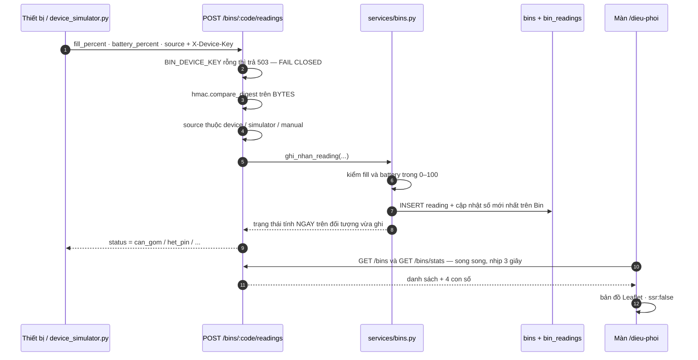

### Bốn trạng thái và thứ tự ưu tiên **bắt buộc**

```
mat_ket_noi  >  het_pin  >  can_gom  >  binh_thuong
```

**Mất kết nối phải thắng.** Một thùng offline 3 ngày vẫn còn lưu con số 85% của
lần báo cuối; nếu xét `can_gom` trước thì đội xe chạy tới một thùng mà **không ai
biết thực sự đầy bao nhiêu**. Cũng phải xét trước `het_pin`: mất kết nối nghĩa là
không biết tình trạng pin hiện tại ra sao.

### Bốn quyết định kỹ thuật trong luồng này

| Quyết định | Vì sao |
|---|---|
| **Fail closed** — `BIN_DEVICE_KEY` rỗng thì chặn hết, trả 503 | Endpoint này ghi các con số mà quyết định điều phối dựa vào. Một hàng ingest hở cho phép bất kỳ ai đánh lừa đội xe chạy tới thùng rỗng, hoặc **giấu một thùng đang đầy** |
| `hmac.compare_digest` trên **bytes** | Chống tấn công timing; và chuỗi có dấu tiếng Việt làm hàm này ném `TypeError` → **500 thay vì 401**, làm bẩn cột "lỗi hệ thống" của trang Vận hành |
| Chuẩn hoá aware/naive **tại chỗ so sánh** | Cột `DateTime` không có `timezone=True` nên SQLite trả naive, còn `utcnow()` của dự án là aware. Đưa việc chuẩn hoá lên caller là rải lỗi ra mọi chỗ gọi |
| `/bins/stats` khai **trước** `/bins/{code}` | FastAPI chọn endpoint theo thứ tự khai báo — đặt sau thì `"stats"` bị coi là một mã thùng và 4 con số trên dashboard biến mất |

> ⚠️ **Bẫy demo:** `BIN_OFFLINE_MINUTES = 30` mà `last_seen_at` của thùng seed tính
> lúc chạy seed. Seed lúc 11:47, mở lúc 14:07 → cả 10 thùng đều "Mất kết nối".
> Cách chữa đúng là **chạy `device_simulator.py` trong lúc demo** — đó vốn là lý
> do nó tồn tại. Đừng nới `BIN_OFFLINE_MINUTES` cho vừa buổi trình bày; đó là bẻ
> cong sản phẩm.

---

### 12.1 Đường phân loại cho thiết bị — `POST /api/v1/iot/captures`

Lát cắt dọc của thùng thông minh: **ESP32-CAM chụp → máy chủ phân loại → trả `route` →
thiết bị quay servo**. Đây là đường riêng cho **thiết bị**, tách khỏi `POST /classify` của
ứng dụng người dùng: thiết bị không có tài khoản, không có token đăng nhập, và khuôn dữ
liệu khác.

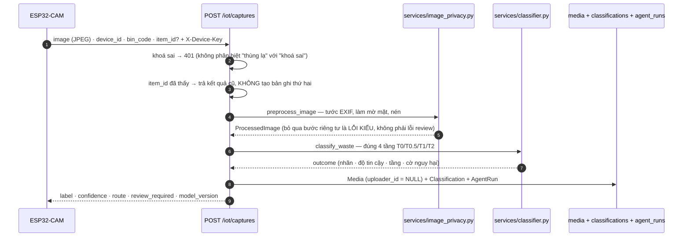

**Bốn ràng buộc kiến trúc của đường này:**

| Ràng buộc | Vì sao |
|---|---|
| Thiết bị **chỉ thực thi `route`**, không tự đặt ngưỡng, không tự quyết nhãn | ADR-0012. Ngưỡng và luật an toàn nằm ở máy chủ; firmware đổi hành vi thì phải nạp lại toàn đội thùng |
| **`label` và `route` tách bạch** — ca không chắc trả `label = "UNKNOWN"` **và** `route = "other"` | `UNKNOWN` nói *máy chủ nghĩ gì*, `route` nói *servo quay đâu*. Gộp hai thứ là mất khả năng đếm số ca không nhận ra được, mà đó là chỉ số chất lượng |
| Nhóm **nguy hại** luôn `review_required = true` bất kể độ tin cậy | Hướng dẫn sai về rác nguy hại là rủi ro thật, không phải rủi ro thẩm mỹ |
| `item_id` do thiết bị sinh → **gửi lại không tạo bản ghi thứ hai** | Mạng ở hiện trường chập chờn; thiết bị thử lại là chuyện thường. Không có khoá này thì một món rác đếm thành nhiều |

**Ghi chú lịch sử.** Nhánh phần cứng của nhóm dựng đường `/iot/captures` kèm **một bộ phân
loại thứ hai** (một lần gọi model, không cache, không CLIP, không YOLO) và **không ghi gì
xuống cơ sở dữ liệu**. Khi gộp hai nhánh, đường dẫn được **giữ nguyên** để firmware đang
chạy không phải sửa, còn **phần lõi được thay** bằng bộ phân loại 4 tầng và đường ghi dữ
liệu thật. Bộ phân loại thứ hai đó chỉ hỗ trợ hai nhà cung cấp model, không có nhà cung cấp
nào đang chạy thật — nó **trả HTTP 200 kèm trạng thái lỗi**, tức hỏng mà không ai thấy.

---

### 12.2 Phiên bỏ rác tại thùng

Nối người dùng với hành động bỏ rác: cư dân xác thực mình đang đứng trước thùng, thùng tự
phân loại từng món, hệ thống đếm và ghi nhận.

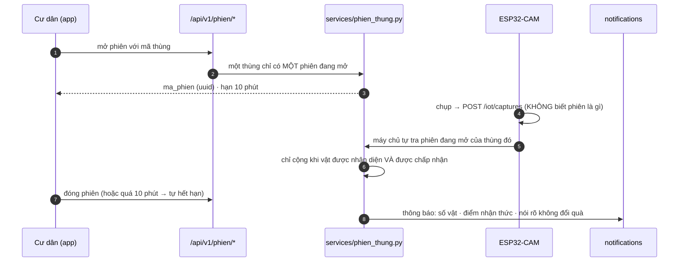

**Tính chất quan trọng nhất: thiết bị không biết "phiên" là gì.** `/iot/captures` vốn đã
nhận `bin_code`, nên máy chủ tự ghép ảnh vào phiên đang mở của thùng đó. Hệ quả: **firmware
không phải sửa một dòng nào**, và **không ai quét mã thì thùng vẫn chạy như thường** — chỉ
là không cộng cho ai. Phần tính điểm hỏng cũng không được làm hỏng phản hồi phân loại: cả
khối được bọc, lỗi thì ghi log và trả kết quả phân loại như bình thường.

**Điểm nhận thức — vì sao đếm được phép mà cân thì không.** Dự án có một luật cứng: *điểm
có giá trị chỉ tính trên khối lượng do người cân*. Luật đó sinh ra vì **không thể ước lượng
khối lượng từ ảnh** — đoán rồi quy ra quà là gian lận. Nhưng thùng **đếm thật** từng món đi
qua bộ phân loại; đó là con số máy ghi nhận, không phải suy đoán. Nên phiên thùng cộng
`diem_nhan_thuc`, và ba ràng buộc được khoá bằng test:

- ⛔ **không** cộng vào `users.green_points`;
- ⛔ **không** ghi vào `diem_thuong_log` (bảng của điểm có giá trị);
- ✅ chỉ ghi vào `phien_thung.diem_nhan_thuc`, **không quy đổi**.

⚠️ Và con số này là **"số vật đã phân loại"**, không phải "số rác đã bỏ": một túi hai mươi
vỏ chai vẫn tính là một. Câu chữ trong thông báo phải nói đúng như vậy.

**Bốn ca thất bại được tách riêng**, mỗi ca một thông báo — gộp chung thành "lỗi" thì người
dùng đứng trước thùng không biết phải làm gì:

| Ca | Người dùng đọc được |
|---|---|
| Không nhận diện được vật | thử đặt lại cho gọn trong khay |
| Ngăn đích đã đầy | đơn vị thu gom đã được báo |
| Thùng mất kết nối giữa chừng | phiên đã lưu phần đã bỏ |
| Quá 10 phút | quét lại mã để tiếp tục |

Phiên đóng vì hết hạn hoặc lỗi mà **đã có vật được chấp nhận** thì **vẫn cộng điểm cho phần
đã bỏ** — không phạt người dùng vì thiết bị hỏng.

**Giới hạn phần cứng đang mở.** Thiết kế đích là mã QR **đổi mới mỗi phiên**, hiện trên màn
OLED của thùng — mã dùng một lần thì không ai chụp ảnh mang về nhà quét để lấy điểm mà
không bỏ rác. Nhưng trên board AI Thinker ESP32-CAM hiện dùng, **màn hình không lắp được
cùng camera**: bốn chân dùng được đã bị bốn cảm biến của giai đoạn 1 chiếm hết (xem
`iot/docs/pin-map.md` mục 6.1), nên firmware chỉ bật màn ở môi trường mô phỏng. Hai đường
đi tiếp: chuyển sang ESP32-S3 nhiều chân hơn, hoặc dùng **mã tĩnh kèm cổng cảm biến người**
— máy chủ chỉ mở phiên khi thùng vừa báo có người đứng trước nó, đạt cùng mục đích chống
gian lận bằng đúng phần cứng đang có.

---

## 13. Mô hình dữ liệu (28 bảng)

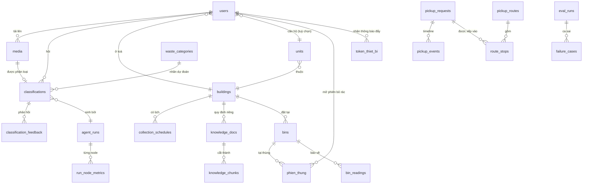

### Nhóm bảng

| Nhóm | Bảng | Ghi chú thiết kế |
|---|---|---|
| Danh tính | `users` `buildings` `units` | PBKDF2 hash, không lưu mật khẩu thô |
| Danh mục | `waste_categories` | 9 nhóm · `min_confidence` **riêng từng nhóm** · `is_hazardous` · `clip_prompts` |
| Ảnh | `media` | `phash` · `exif_stripped` · `faces_blurred` · **`removed_fields`** · `expires_at` · `kept_for_eval` |
| Phân loại | `classifications` `classification_feedback` | `items` JSON nhiều món · `refused` + `refusal_reason` · `tier` `model` `prompt_version` · `advice_sources` · `latency_ms` `cost_usd` |
| Tri thức | `knowledge_docs` `knowledge_chunks` | `embedding` là JSON list cho SQLite → đổi sang kiểu `vector` của pgvector khi lên Postgres, phần còn lại giữ nguyên |
| Thu gom | `pickup_requests` `pickup_events` `pickup_routes` `route_stops` | **khối lượng là KHOẢNG** `weight_min`/`weight_max`; ngưỡng HITL so với **cận trên** |
| Vận hành | `agent_runs` `run_node_metrics` `audit_log` `alerts` `notifications` `collection_schedules` | mỗi node đi qua để lại một bản ghi, không ngoại lệ |
| Chất lượng | `eval_runs` `failure_cases` | |
| Thùng | `bins` `bin_readings` | số mới nhất nằm trên `bins` cho màn điều phối; lịch sử đầy đủ ở `bin_readings` |

**Hai quy ước xuyên suốt:**

- **`is_seed`** — mọi bản ghi demo đều gắn cờ, và trang Vận hành **tách riêng** số
  liệu seed khỏi số liệu thật. Không bao giờ để dữ liệu mô phỏng trộn vào chỉ số
  đưa lên báo cáo.
- **Khối lượng là khoảng, không phải một số.** Vision ước lượng kg từ ảnh sai vài
  lần là bình thường; sai số phải nghiêng về phía **cần người duyệt**
  ([ADR-0003](docs/decisions/0003-phan-tang-rac-va-trong-tam-doi-ve-sinh.md)).

---

## 14. Bề mặt API và phân quyền

51 route, tiền tố `/api/v1`. Khuôn lỗi thống nhất cho **mọi** loại lỗi:

```json
{"error": {"code": "VISION-500", "message_vi": "…", "detail": {}}}
```

| Nhóm | Route tiêu biểu | Quyền |
|---|---|---|
| Xác thực | `POST /login` · `GET /me` · `GET /demo-accounts` | công khai / đã đăng nhập |
| Phân loại | `POST /classify` · `POST /classify/text` · `GET /classifications` · `POST /classifications/{id}/feedback` | `classify` |
| HITL #2 | `GET /verify-queue` · `POST /classifications/{id}/verify` | `verify_label` — cleaner + manager |
| Ảnh | `GET /media/{id}` · `GET /media/{id}/privacy` · `GET /media/{id}/original` · `DELETE /media/{id}` | `view_original_media` — **manager, và mỗi lần xem ghi `AuditLog`** |
| Danh mục | `GET /categories` · `PATCH /categories/{code}` · `GET /buildings/{id}/schedule` · `POST /knowledge/test-retrieval` | `edit_catalog` cho PATCH |
| HITL #1 | `POST /pickups` · `POST /pickups/{id}/review` | `review_pickup` — chỉ manager |
| HITL #3 | `POST /routes/propose` · `POST /routes/{id}/review` · `POST /routes/{id}/stops/{id}/done` | `review_route` — chỉ manager |
| Thùng | `GET /bins` · `GET /bins/stats` · `GET /bins/{code}` | `view_bins` — cleaner + manager |
| Giao thùng | `PATCH /bins/{code}/nhan-vien` | `assign_bin` — **chỉ manager**, ghi `AuditLog` mỗi lần giao |
| Điểm gửi (cư dân) | `GET /bins/diem-gui` | `view_diem_gui` — bản thu gọn, **không kèm dữ liệu vận hành** |
| Hồ sơ cá nhân | `PATCH /auth/me` · `GET /auth/me/history` · `GET /buildings/{id}/units` | `edit_own_profile` — `email` và `role` không nằm trong schema sửa |
| Đăng ký | `POST /auth/register` | **công khai** — vai trò luôn là `resident`, client không tự chọn được. ⚠️ chưa có rate limit |
| Ingest thiết bị | `POST /bins/{code}/readings` | **không JWT** — `X-Device-Key`, fail closed |
| Vận hành | `GET /ops/metrics` · `GET /runs` · `GET /runs/{id}` · `GET /eval/summary` · `GET /alerts` | `view_ops` `view_runs` `view_eval` — manager |
| Công khai | `GET /health` · `GET /api/v1/status` | không cần đăng nhập |

**Ma trận 19 quyền × 3 vai trò** ở `src/services/auth.py:PERMISSIONS`. Nguyên tắc
UI đi kèm: vai trò không có quyền thì **hiện mờ kèm tooltip giải thích, không ẩn
hẳn** — để ranh giới phân quyền nhìn thấy được, thay vì để người dùng đoán.

`GET /api/v1/status` trả provider từng tầng và **có key hay chưa**; **giá trị key
không bao giờ được trả ra ngoài**.

---

## 15. Quyền riêng tư ảnh

Đây là phần mạnh nhất của đề về mặt an toàn AI, và **không được cắt**.

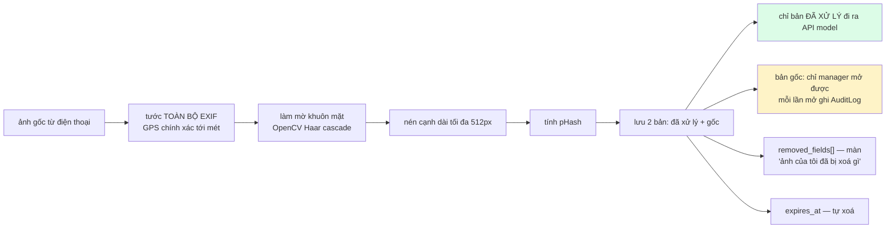

**Vì sao nghiêm đến thế:** ảnh thùng rác có thể chứa khuôn mặt, biển số xe, số căn
hộ, **hoá đơn/giấy tờ có tên và địa chỉ**, nhãn thuốc. Và mọi ảnh chụp bằng điện
thoại đều mang EXIF chứa toạ độ GPS chính xác tới mét.

Có **test khẳng định EXIF đã sạch** sau tiền xử lý — đây là loại bảo đảm phải
kiểm bằng test, không phải bằng review code.

Service worker của PWA **không bao giờ cache ảnh cư dân hay endpoint có token**.

---

## 16. Quan sát và đo đạc

### 16.1 Đo hệ thống

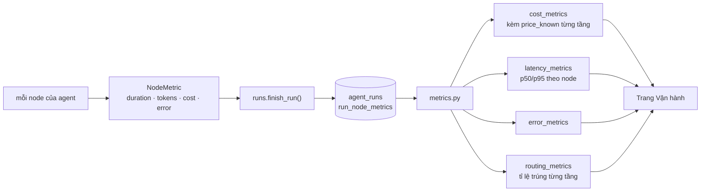

Trạng thái một lần chạy có **ba** giá trị, không phải hai:

| `AgentRun.status` | Nghĩa |
|---|---|
| `ok` | mọi node xanh |
| `degraded` | **có node lỗi nhưng pipeline vẫn ra kết quả** — ví dụ T1 hỏng, T2 cứu |
| `error` | không ra được kết quả |

Tách `degraded` ra để trang Vận hành đếm đúng: một hệ thống tự cứu được không nên
bị tính là hỏng, nhưng cũng không được giả vờ là hoàn toàn khoẻ.

**"$0 vì chưa tra được giá" ≠ "$0 thật".** NVIDIA không công bố giá $/1M token cho
`llama-3.2-90b-vision` (tier developer chạy bằng credit + giới hạn nhịp), nên
`cost_metrics` trả thêm `price_known` từng tầng và UI hiện **"chưa có giá"**. Tầng
chạy trên máy mình (T0, T0.5) vẫn là $0 thật. **Không điền số mò vào bảng giá** —
làm thế là biến cột chi phí thành số bịa.

### 16.2 Nhật ký phiên code AI (deliverable #4)

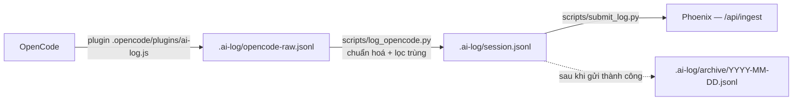

**Tách hai chặng có chủ đích:** plugin chạy *trong tiến trình OpenCode* nên chỉ
được ghi file — không gọi git, không chạm mạng. Mọi việc gọi git dồn về lúc chạy
script.

Bắt được: prompt · từng lệnh tool · model · **chi phí + token + độ trễ từng lượt**.

```bash
cd C:/P-075 && python scripts/log_opencode.py && python scripts/submit_log.py
```

Ba điều đã đo, đừng phải tìm lại: hook `chat.message` **không mang tên model**
(phải ghép ngược từ `message.updated`) · OpenCode gọi hook **hai lần** cho cùng
một sự việc cách nhau ~1 ms (đã chặn trùng ở cả hai lớp: 33 → 0 bản ghi trùng) ·
**sửa plugin xong phải khởi động lại OpenCode**.

---

## 17. Xử lý lỗi và suy giảm có kiểm soát

Yêu cầu bắt buộc của chương trình: *"xử lý lỗi và cảnh báo giới hạn của hệ thống"*.

| Hỏng cái gì | Hệ thống làm gì | Người dùng thấy gì |
|---|---|---|
| T1 lỗi / JSON hỏng | **T2 cứu** nếu khác provider | kết quả bình thường · run `degraded` |
| T1 và T2 cùng hỏng | từ chối, `refusal_reason=model_loi` | "Hệ thống nhận diện đang gặp sự cố" |
| T2 lỗi khi escalate | **giữ kết quả T1**, để cửa ngưỡng phán | không âm thầm nâng độ tin cậy |
| Cạn quota Gemini | chỉ mất tầng dùng Gemini | các tầng khác vẫn chạy |
| Mất API embedding | RAG **lui về thuần BM25** | `degraded=True` + ghi rõ lý do trên UI |
| Model local chưa nạp xong | bỏ qua T0.5, `status="skipped"` | không ai biết, chỉ chậm hơn |
| Chưa có `BIN_DEVICE_KEY` | ingest thùng **fail closed** 503 | thông báo nói rõ phải đặt biến nào |
| Ảnh quá 12 MB / không đọc được | `IMG-413` / `IMG-415` | thông báo tiếng Việt |
| Nạp dữ liệu nền thất bại lúc khởi động | **vẫn để máy chủ lên** | trang lỗi còn đọc được, hơn là cả service chết |

**Nguyên tắc chung:** mọi mã lỗi đều có `message_vi` viết cho người thật đọc, và
mọi trạng thái suy giảm đều **hiện ra trên UI** thay vì im lặng.

---

## 18. Kiến trúc frontend

```
frontend/src/
├─ app/
│  ├─ page.tsx          ← SPA theo vai trò: resident · cleaner · manager
│  ├─ dieu-phoi/        ← màn Điều phối thùng (bản đồ Leaflet)
│  └─ tai-app/          ← trang tải APK / cài PWA
├─ components/
│  ├─ resident/  ask · onboarding · personal · pickup-wizard · result
│  ├─ cleaner/   screens
│  ├─ manager/   console · insights · queues
│  ├─ bins/      6 file từ bản thiết kế Lovable
│  ├─ pwa/       cai-app · register-sw
│  └─ ui/        primitives · shell
└─ lib/  api · bins · format · icons · platform · session · types · utils
```

**Ba ràng buộc kiến trúc frontend:**

1. **`output: "export"` là bất khả xâm phạm.** Nó là điều kiện để cùng một bản
   build phục vụ Vercel + Capacitor + service worker. Đây là lý do Leaflet phải
   nạp bằng `dynamic(..., {ssr: false})`, và là lý do **không đổi sang TanStack
   Start** dù bản thiết kế Lovable viết bằng nó.
2. **Camera gói trong `lib/platform.ts`** — một chỗ duy nhất biết đang chạy trên
   web hay trong app native.
3. ⚠️ **Hai hệ design token đụng nhau, đã xử lý bằng lớp ánh xạ trong
   `globals.css`.** Tên shadcn (`bg-card`, `text-muted-foreground`, `bg-warn`…)
   trỏ về màu thương hiệu GreenBin, **không sửa một className nào** trong 55 chỗ
   của bản thiết kế. Muốn chỉnh tông màn `/dieu-phoi` thì sửa đúng chỗ đó.

   Đặc biệt: `--color-muted` của shadcn là màu **nền**, còn repo đã dùng nó làm
   màu **chữ phụ** ở 102 chỗ → đã tách thành `--color-muted-bg`. Định nghĩa đè lên
   sẽ làm toàn bộ chữ phụ hoá gần trắng trên nền sáng.

**Màn `/dieu-phoi` không bao giờ tự bịa số:** nhịp làm mới 3 giây chỉ gọi lại API;
số chỉ đổi khi có thiết bị thật — hoặc bộ mô phỏng — đang bơm dữ liệu vào.

### 18.1 Chỉ có ba đường dẫn thật — phần còn lại là trạng thái trong ứng dụng

Sản phẩm là **một ứng dụng trang đơn**: việc chuyển tab (Phân loại · Yêu cầu ·
Lịch · Điểm gửi · Tôi, và các hàng đợi của đơn vị thu gom) là **trạng thái React**,
không phải đường dẫn trình duyệt. Toàn hệ thống chỉ export đúng ba trang:

| Đường dẫn | Nội dung | Đo trên bản chạy thật |
|---|---|---|
| `/` | Ứng dụng theo vai trò: cư dân · nhân viên thu gom · đơn vị thu gom | HTTP 200 |
| `/tai-app/` | Hướng dẫn cài APK / PWA | HTTP 200 |
| `/dieu-phoi/` | Bản đồ điều phối thùng, chiếm trọn màn hình | HTTP 200 |

Hệ quả cần biết khi kiểm thử: **mọi đường dẫn khác trả 404, và đó là hành vi
đúng** chứ không phải lỗi định tuyến. Ví dụ `/pickups`, `/auth/login` không tồn
tại vì hai màn đó nằm bên trong `/`; còn `/classify/text` là **đường API của máy
chủ**, không phải một trang web. Bản export tĩnh sinh sẵn file HTML cho từng
trang thật nên deep-link và F5 đều chạy — **không cần `vercel.json` rewrite**.

Đánh đổi có chủ đích của mô hình này: đường dẫn không mô tả được vị trí người
dùng đang đứng, nên **không chia sẻ được link tới một tab cụ thể** và nút Back
của trình duyệt không đi ngược từng tab. Chấp nhận được với một ứng dụng dùng
trên điện thoại là chính; muốn đổi thì phải bỏ `output: "export"` — xem ràng
buộc 1 ở trên.

---

## 19. Triển khai và CI/CD

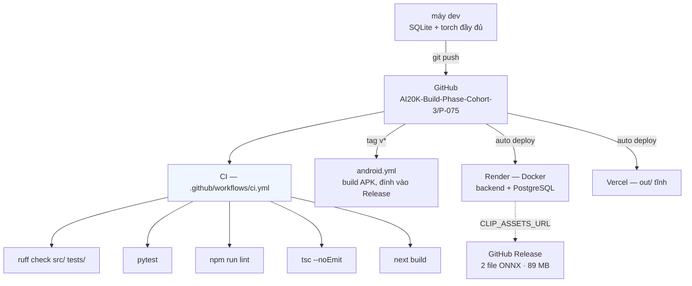

| Hạng mục | Cấu hình |
|---|---|
| Backend | Render web service · Docker · Singapore · plan free (**512 MB RAM**) · `healthCheckPath: /health` |
| CSDL | Render PostgreSQL free |
| Frontend | Vercel, phục vụ `frontend/out/` |
| Khởi động | `SEED_ON_START` tự nạp dữ liệu nền; `bootstrap()` gọi lại nhiều lần vô hại |
| Model local | Nạp trước ở **luồng nền** lúc khởi động, không chặn máy chủ lên |
| Nhúng kho quy định | `EMBED_KB_ON_START` chạy ở luồng riêng vì nó đụng mạng |

**Ràng buộc 512 MB là ràng buộc thiết kế thật, không phải chi tiết vận hành.** Nó
là lý do CLIP phải nén xuống ONNX int8 (185 MB RAM), và là lý do khi làm YOLO thì
**YOLO phải THAY CLIP chứ không cộng thêm** — chạy cả hai là chạm trần và Render
**giết tiến trình chứ không cảnh báo**.

> ⚠️ Bản deploy đang chạy (`greenbin-api-hozl.onrender.com` /
> `test-gbai-gray.vercel.app`) là của **repo cá nhân** `imninh/Test_GBAI`. Repo
> nhóm **chưa được deploy** — xem mục 21.

---

## 20. Ánh xạ tiêu chí chấm và PLO

| PLO | Nội dung | Thể hiện ở đâu trong kiến trúc này |
|---|---|---|
| 1 | Kiến trúc agent, model routing | Định tuyến 4 tầng (mục 8) · provider theo tầng |
| 2 | Multi-agent, trace được | Graph `classify → advise → schedule` · nhánh skip vẫn ghi node · màn Agent Run |
| 3 | RAG vượt naive, có đo lường | Hybrid BM25 + embedding · lọc theo toà · hit@k + MRR (mục 11.1) |
| 4 | Giá trị kinh doanh | Giảm phí xử lý rác · giảm số chuyến xe (so `baseline_km`) · nền pháp lý |
| 5 | Hạ tầng, giám sát độ trễ/lỗi/chi phí | `metrics.py` + trang Vận hành · `price_known` (mục 16.1) |
| 6 | Guardrails, HITL, chống rò rỉ dữ liệu | `_finalize` 7 cửa · 3 điểm HITL · pipeline ảnh (mục 10, 15) |
| 7 | Eval pipeline, failure → cải tiến | `eval/run_eval.py` + `run_retrieval_eval.py` · lý do từ chối chọn từ danh sách cố định |
| 8 | Vibe coding có kiểm soát | AI logging → Phoenix · `JOURNAL.md` · `WORKLOG.md` · 8 ADR |

| Tiêu chí chấm | Bằng chứng trong repo |
|---|---|
| **Product/Business** | 3 vai trò thật · mỗi kết quả AI sinh hành động hoặc bản ghi · nền pháp lý NĐ 45/2022 |
| **System Design** | 4 tầng model · provider theo tầng · 2 state machine · suy giảm có kiểm soát |
| **UX/UI** | 21+ màn · từ chối có giải thích · quyền hiện mờ kèm tooltip · lịch thu gom xem được offline |
| **DevOps** | CI kiểm cả Python lẫn frontend · build APK theo tag · `render.yaml` khai cả web lẫn CSDL |
| **Code Quality** | ruff sạch · type hints hàm public · không bare `except` · 277 test · module thuần tách khỏi I/O |

> Bài học Cohort 1: **DevOps và Code Quality là hai cột điểm thấp nhất**; 0/12 đội
> có CI/CD dù template cho sẵn, chỉ 2/12 đội có eval evidence. Hai cột đó là chỗ
> dễ ăn điểm nhất và cũng là chỗ dễ mất nhất.

---

## 21. Giới hạn đã biết và nợ kỹ thuật

Ghi thẳng, vì "nêu rõ giới hạn, rủi ro, hướng cải tiến" là **yêu cầu chấm điểm**.

### ⛔ Đang chặn

| Việc | Ảnh hưởng |
|---|---|
| **Chưa có bộ 100 ảnh tự chụp** | Chặn eval phân loại · chặn chuẩn lại `CLIP_ACCEPT_CONFIDENCE` cho bản ONNX · chặn việc **chứng minh** YOLO tốt hơn thay vì chỉ nói là tốt hơn. Số liệu trang Chất lượng AI hiện là **dữ liệu demo mô phỏng**, có gắn nhãn rõ trên UI |
| ~~**Nhiều gói chưa commit**~~ | **Đã hết** — code đang ở `main` của repo deploy, Railway tự dựng lại sau mỗi lần đẩy |
| ~~**Bản deploy đã cũ**~~ | **Đã hết** — backend Railway + web Vercel chạy bản hiện hành, `/health` 200. **Còn nợ:** repo nhóm `AI20K-Build-Phase-Cohort-3/P-075` chưa merge |
| ~~**`pickup_requests.unit_id` đang NOT NULL**~~ | **Đã hết.** Cột đã nới, `users` và `pickup_requests` đều có `address`/`lat`/`lng`, và `users.building_id` thành liên kết chính thay cho đường vòng qua `units`. Cư dân không gắn căn hộ nay tạo được yêu cầu, có địa chỉ riêng cho từng lần lấy hàng. *(Nguyên văn:)* | Chặn **600/606 tài khoản cư dân** (nhập từ workbook GIS, rải khắp Hà Nội nên không thuộc căn hộ nào) — họ **không tạo được yêu cầu thu gom**. Nghiệp vụ mới cho cư dân *chọn địa điểm* từng yêu cầu, nên cần cột `address/lat/lng` trên chính yêu cầu + `ALTER … DROP NOT NULL`. Đụng CSDL đang chạy nên chờ người duyệt |
| **Quota Groq quá chật cho đường nóng** | Gói free **8.000 token/phút**. Đo 16/08: bật `reasoning_effort=none` kéo token đầu ra từ **2000 → 148** nên đỡ hẳn, nhưng vài người dùng đồng thời vẫn đụng 429. Đường dài phải đổi tầng T2 sang nhà cung cấp khác hoặc trả phí |
| **Thiếu 3 deliverable Demo Day** | Pitch deck · video demo · live URL bản mới. Không phải việc code, cần người dựng. *(Bằng chứng đánh giá và bản trích dẫn AI log đã xong.)* |

*(2 test đỏ của `test_pickup_lifecycle.py` đã hết — bộ test hiện **423 passed**.)*

### Lỗi đang mở

**`SRV-500 / StatementError` ở đường ảnh trên PostgreSQL.** Chỉ xảy ra ở đường
ảnh, chỉ trên Postgres; đường chữ chạy tốt. Đã loại trừ 9 giả thuyết. Nghi ngờ
hàng đầu chưa kiểm được: `stored_path`/`original_path` là `String(400)` — Postgres
ép độ dài `VARCHAR` còn SQLite thì bỏ qua. **Đừng sửa mò khi chưa có 2 dòng log
Render.**

### Nợ kiến trúc đã biết

| Nợ | Chi tiết |
|---|---|
| **Di trú trạng thái dở dang** | Chỗ đọc đã lật, chỗ **ghi** còn từ vựng cũ. Hai bộ từ vựng dùng chung 3 từ (mục 11.3) |
| **Một ảnh vẫn ép một nhãn** | Kiến trúc cũ không có chỗ nói "bình giữ nhiệt → kim loại **và** củ sạc → nguy hại". **Đã dựng đường gốc (hướng A + YOLO)**: `phat_hien_co_hop` quy hộp YOLO về toạ độ ảnh gốc, `services/phan_loai_nhieu_vat.py` cắt từng vật rồi để **CLIP chấm từng crop** — YOLO chỉ định vị, không bao giờ là nhãn rác. **Mặc định TẮT** (`phan_loai_tung_vat=false`) tới khi đo trên ảnh thật. Lý do làm: ảnh 8 vật kéo confidence CLIP toàn khung xuống **0,1356**, cắt riêng thì chốt được tại chỗ và $0 |
| ~~**Ảnh cư dân nằm trên đĩa tạm**~~ | **Đã hết** — ảnh đi thẳng Supabase Storage (`uploads/YYYY/MM/DD/`), `/ops/metrics` có khối `storage` tự ghi→đọc→xoá để nhìn thấy tầng này sống hay chết. ⚠️ Ảnh tải lên **trước** 16/08 vẫn nằm ở đĩa và sẽ mất khi máy chủ khởi động lại |
| ~~**Vào thẳng `/dieu-phoi` khi chưa đăng nhập thì bí đường**~~ | **Đã hết** — nhánh 401 nay hiện nút quay về `/` kèm câu nói rõ có sẵn tài khoản demo; luồng đã-đăng-nhập không đổi. *(Nguyên văn phát hiện cũ:)* Màn hiện "Bạn cần đăng nhập" và các lệnh gọi API trả 401, nhưng **không đưa người dùng về màn đăng nhập** — mà màn đăng nhập lại nằm ở `/`, kèm ba nút vào thẳng bằng tài khoản demo. Người kiểm thử bên ngoài dễ kẹt ở đây. Cần: 401 thì chuyển về `/` và nói rõ có tài khoản demo (phát hiện A-03 của rà soát QA Gate 01, 13/08) |
| ~~**Luồng đồ cồng kềnh không nhìn thấy được từ trang chủ**~~ | **Đã hết** — màn chính của cư dân nay có lối vào thẳng "Đặt lịch thu gom đồ cồng kềnh", đường cũ ở tab *Yêu cầu* giữ nguyên. *(Nguyên văn phát hiện cũ:)* Wizard đăng ký thu gom nằm trong tab *Yêu cầu*, sau khi đăng nhập — người mở web lần đầu chỉ thấy phần chụp ảnh phân loại nên tưởng sản phẩm chỉ có chừng đó. Đây là vấn đề **chỗ đặt lối vào**, không phải thiếu tính năng: máy trạng thái 10 bước và màn duyệt của đơn vị thu gom đều đã chạy (phát hiện A-02 của rà soát QA Gate 01) |
| **Chưa có ô chat tra cứu quy định** | Hiện cư dân hỏi bằng chữ **bên trong tab Phân loại** và nhận hướng dẫn có trích nguồn; chưa có khung chat nhiều lượt như bản đặc tả Gate 01 mô tả. Phần truy hồi (RAG hybrid, mục 11.1) đã sẵn — thiếu lớp giao diện hội thoại (phát hiện A-04) |
| **Bẫy: model reasoning + JSON mode** | `qwen3.6-27b` (Groq) tiêu **hết trần 2000 token vào phần suy nghĩ** rồi trả nội dung rỗng; bật `response_format: json_object` thì Groq kiểm JSON trên chuỗi rỗng và trả **HTTP 400 `json_validate_failed`** — nhìn như "model hỏng" suốt hai ngày. Cách chữa đang dùng: với `groq` thì gửi `reasoning_effort=none` + `reasoning_format=hidden` và **bỏ** `response_format`, để `parse_model_json` của mình tự bóc. Model reasoning mới nào cắm vào cũng phải kiểm lại chỗ này |
| **T1 mù đồ điện tử** | Đo 03/08 trên ảnh rác thật: llama-90b **0/6**, nemotron-12b 1/6, Gemini 2/2, **YOLO11n local 4/4 trong ~100 ms và $0**. Chỉ số an toàn "nguy hại thành rác thường" vì thế đang trượt trên ảnh có đồ điện tử |
| ~~`classifier.py` 564 dòng~~ | **Đã hết** — đo lại 10/08: `src/services/classifier.py` còn **134 dòng**, `classify_waste` là hàm cấp cao duy nhất. Phần nặng đã nằm ở các module riêng. Không còn là chốt chặn trước khi động vào YOLO |
| ~~**Nhân viên vệ sinh thấy mọi thùng**~~ | **Đã hết.** Finding **C-01** của Gate 01 đóng lại: cả nửa GHI lẫn nửa ĐỌC đã xong, và nay chặn **hai lớp** — theo đơn vị thu gom rồi theo nhân viên. Quyết định "ai thấy gì" nằm gọn trong `loc_theo_nguoi_xem` + `to_chuc_cua_nguoi_xem` ở `services/bins.py`, có test quét để không ai rải điều kiện ra router |
| ~~**`/auth/register` chưa có rate limit**~~ | **Đã có** — cửa sổ trượt theo IP, mặc định 10 lần / 10 phút, `0` để tắt. **Còn nợ:** bộ đếm nằm trong bộ nhớ tiến trình (nhiều worker = nhiều bộ đếm), và **chưa có bước xác thực số điện thoại** |
| ~~**Thứ tự ghé cố định điểm đầu**~~ | **Đã thả** — nearest-neighbour chạy từ nhiều điểm xuất phát (chặn ở 8), đo thêm **−6,3%**, lên 97–98/100 bộ tối ưu tuyệt đối. Thêm đường **tuỳ chọn mặc định TẮT** lấy khoảng cách đường đi thật từ OSRM, hỏng thì rơi êm về haversine |
| **Màn hình thùng chỉ chạy được trong mô phỏng** | Thiết kế đích là mã QR đổi mỗi phiên hiện trên OLED, nhưng trên AI Thinker ESP32-CAM **bốn chân dùng được đã bị bốn cảm biến giai đoạn 1 chiếm hết** (`iot/docs/pin-map.md` mục 6.1: *"4 available, 4 required → zero margin"*). Màn I2C cần thêm hai chân. Firmware vì thế chỉ bật màn ở môi trường Wokwi; bản chạy thật biên dịch `NullDisplay`. Hai đường: chuyển ESP32-S3, hoặc dùng mã tĩnh kèm cổng cảm biến người |
| **Cửa vào phiên có thể phải đảo chiều** | Hiện **ứng dụng** mở phiên từ mã thùng. Nếu chốt phương án mã QR đổi mỗi phiên thì **thiết bị** phải xin mã trước rồi ứng dụng quét vào để nhận. Phần lõi (đếm vật, điểm, thông báo, hết hạn) không đổi — chỉ đổi cửa vào |
| **Điểm mỗi vật chưa có căn cứ** | `DIEM_NHAN_THUC_MOI_VAT = 5` là con số đặt tạm để chạy được, chưa dựa trên khảo sát hay đối chiếu nào. Là hằng số có tên nên đổi một chỗ, nhưng **phải chốt trước khi có người dùng thật** — đổi sau thì điểm cũ và mới không so sánh được |
| **Thông báo đẩy mới có nền, chưa có đường** | Bảng `notifications` và `token_thiet_bi` đã có, `GET /notifications` đã chạy, nhưng **chưa đấu Firebase Cloud Messaging** nên thông báo chỉ hiện khi ứng dụng đang mở. Cần khoá máy chủ, `google-services.json`, và một lần dựng lại APK |
| **Hợp đồng thiết bị và tài liệu lệch nhau** | `GET /bins/{code}/readings` đã đổi khuôn trả về (đọc từ CSDL thay vì bộ nhớ tiến trình) và `/iot/captures` đã thêm `route`/`item_id`, nhưng `iot/docs/api-contract.md` chưa cập nhật theo. Firmware không gọi đường GET đó nên chưa ai vỡ |
| **Endpoint ingest chưa chống replay** | Mỗi thùng đã có khoá riêng và thu hồi được bằng tay, nhưng một request bắt được vẫn phát lại được. Cần nonce + mốc thời gian, và một lịch xoay vòng khoá |
| **Ma trận quyền lệch với spec** | `view_diem_gui` · `edit_own_profile` · `assign_bin` đã có trong code nhưng **chưa chép sang `docs/FRONTEND_SPEC.md` mục 1**, trong khi chính docstring của `auth.py` yêu cầu sửa một bên thì sửa cả hai |
| Alembic | Chưa dùng, **hoãn có chủ đích**. Thay bằng bảng khai báo `COT_CAN_VA` ở `src/db/schema_patch.py`, vá cột lúc khởi động, chạy được trên cả SQLite lẫn PostgreSQL. Chuyển sang Alembic khi schema ổn định |
| pgvector | `embedding` còn là JSON list; đổi sang kiểu `vector` khi lên Postgres |
| ~~Khoá thiết bị chung~~ | **Đã hết.** Mỗi thùng một khoá riêng lưu dạng băm SHA-256; thùng đã cấp khoá thì khoá chung không mở được nữa, thùng chưa cấp vẫn dùng khoá chung nên đội thùng ngoài hiện trường không chết giữa chừng. Thu hồi bằng `scripts/cap_khoa_thung.py --thu-hoi` — cấp một khoá mới rồi vứt chuỗi thô, nên thùng khoá chặt chứ **không** rơi về khoá chung |
| Chưa phỏng vấn lao công + BQL | Chỗ yếu nhất của ADR-0002/0003. ADR-0008 không vá được — nó là tiếng nói cư dân, không phải người vận hành |
| APK chưa ai thử | Khung Android đã dựng, chưa ai cầm máy chạy thử |

**Một phát hiện QA đã kiểm lại và KHÔNG tái hiện được.** Bản rà soát QA Gate 01
(13/08) chấm mức nghiêm trọng nhất cho *"17/19 đường dẫn trả 404 do thiếu
`vercel.json`"*. Đo lại trực tiếp trên bản chạy thật: cả **ba** đường dẫn có thật
đều trả **HTTP 200** kể cả khi gõ thẳng hoặc bấm F5 (`/` · `/tai-app/` ·
`/dieu-phoi/`). Các đường trả 404 trong báo cáo là **URL không thuộc sản phẩm** —
`/pickups` và `/auth/login` là hai màn nằm *bên trong* `/`, còn `/classify/text`
là đường **API của máy chủ**, không phải trang web. Xem mục 18.1. **Không thêm
`vercel.json` rewrite**: bản export tĩnh đã sinh sẵn HTML cho từng trang thật, và
rewrite tất-cả-về-`/` sẽ làm mất đúng hai trang đang chạy tốt.

### ADR còn nợ

**ADR-0009** và **ADR-0010** đã viết xong ngày 06/08 — xem mục 22.

Còn nợ đúng một: **ADR-0011 — YOLO ở tầng T0.5.** Quyết định đã ra ngày 03/08
kèm số đo (YOLO11n phát hiện đồ điện tử 4/4 trong ~100 ms và $0, so với
llama-90b 0/6 và nemotron-12b 1/6), nhưng **chưa viết thành ADR** và **repo
không có một dòng YOLO nào**. Đặc tả nằm trong bản bàn giao nội bộ ngày 03/08
của nhóm, không nằm trong repo.

⚠️ Vì vậy, câu đúng khi trình bày là: *"đã đo YOLO11n ~100 ms trên CPU, nhưng
hiện chưa cắm vào sản phẩm"* — **không nói "hệ thống em dùng YOLO"**.

### Giới hạn khoa học phải nói rõ trong báo cáo

> Model đạt **94,18% trên TrashNet** chỉ còn **41,04% trên RealWaste** (ảnh rác
> thật tại bãi). Vì vậy: (1) **không bao giờ** đưa accuracy của dataset công khai
> lên slide như thể đó là năng lực sản phẩm; (2) bộ ảnh tự chụp là bộ **quan trọng
> nhất**, không phải bộ bổ sung.

---

## 22. Chỉ mục ADR

| ADR | Quyết định |
|---|---|
| [0001](docs/decisions/0001-chon-de-tai-greenbin.md) | Chọn đề VHR-17 GreenBin (loại 3 đề khác, có lý do) |
| [0002](docs/decisions/0002-chuyen-trong-tam-sang-van-hanh.md) | Chuyển trọng tâm sang vận hành: BQL + đội vệ sinh là người dùng chính |
| [0003](docs/decisions/0003-phan-tang-rac-va-trong-tam-doi-ve-sinh.md) | Phân tầng rác — chỉ luồng B qua AI; khối lượng là khoảng |
| [0004](docs/decisions/0004-tu-lam-auth-thay-vi-supabase.md) | Tự làm auth PBKDF2 + JWT thay vì Supabase |
| [0005](docs/decisions/0005-pwa-va-capacitor-thay-vi-viet-lai-native.md) | PWA + Capacitor, một bản build dùng chung; Render thay Railway |
| [0006](docs/decisions/0006-provider-theo-tung-tang.md) | Provider khai riêng từng tầng |
| [0007](docs/decisions/0007-tang-t05-chay-onnx-int8.md) | T0.5 chạy ONNX int8 để vừa máy chủ 512 MB |
| [0008](docs/decisions/0008-dinh-chinh-pham-vi-cu-dan-do-cong-kenh.md) | Đính chính phạm vi: cư dân **có** pain point ở đồ cồng kềnh |
| [0009](docs/decisions/0009-phan-cung-vao-pham-vi.md) | Phần cứng vào phạm vi — **chỉ với vai trò nguồn dữ liệu**, không làm cơ cấu phân loại tự động |
| [0010](docs/decisions/0010-doi-nguoi-dung-trung-tam.md) | Đổi người dùng trung tâm: cư dân + nhân viên thu gom (app) · đơn vị thu gom (web) |
| 0011 | *(nợ)* YOLO ở tầng T0.5 |
| [0012](docs/decisions/0012-mo-lai-pham-vi-phan-cung.md) | Mở lại phạm vi phần cứng — thùng ESP32 **được** tự phân loại, nhưng phần mềm vẫn quyết nhãn và chốt an toàn giữ nguyên |

---

## Phụ lục — chạy tại chỗ

```bash
cd C:/P-075
python scripts/seed.py --reset --demo                        # dữ liệu nền + 10 thùng demo
python -m uvicorn src.main:app --port 8000                   # backend · docs ở /docs
npm --prefix frontend run dev                                # frontend ở :3000
python scripts/device_simulator.py --steps 20 --interval 3   # cho thùng "sống"
```

Tài khoản demo: `resident@demo.vn` · `cleaner@demo.vn` · `manager@demo.vn`,
mật khẩu chung `demo1234`. Đăng nhập được cả bằng **số điện thoại**
(`0901000001` · `0901000002` · `0901000003`). Màn đăng nhập có 3 nút vào thẳng.
Màn `/dieu-phoi` cần vai `cleaner` hoặc `manager`.

Tầng T0.5 cần cài thêm: `pip install -r requirements-local-model.txt`
(torch 1,19 GB đã tách khỏi `requirements.txt` để bản deploy nhẹ).
