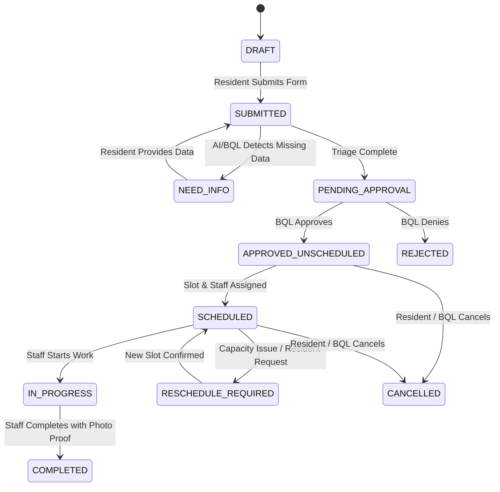

# BQL Management Dashboard - System Architecture & AI Specification

> **Document Context**: Technical Specification for AI Agent & System Implementation  
> **Domain**: GreenBin Ops — Property Operations & Bulky Waste Management Subsystem  
> **Primary Users**: Property Operations Manager (Trưởng BQL), Receptionist (Lễ tân), Sanitation Lead (Tổ trưởng vệ sinh)

---

## 1. System Overview & Core Objective

The **BQL Management Dashboard** acts as the central operational hub for building management teams to process, validate, approve, schedule, and audit bulky waste collection requests (`GreenBin Ops`).

### Key Operational Goals
- **Eliminate Fragmented Channels**: Consolidate unstructured resident messages (Zalo, phone calls, paper logs) into structured work orders.
- **Enforce Data Completeness**: Achieve $\ge 90\%$ first-pass data completeness (photos, dimensions, location, quantity).
- **Human-in-the-Loop (HITL) Safety**: AI assists in triage and policy matching, but **human managers retain total control** over approvals, fees, and final scheduling.
- **End-to-End Auditability**: 100% of state changes must record actor ID, timestamp, and rationale.

---

## 2. Data Schemas & Entities

### 2.1 `BulkyWasteRequest` Entity Schema
```json
{
  "request_id": "UUID",
  "building_id": "STRING (e.g. BLD_ANBINH_01)",
  "unit_number": "STRING (e.g. A1204)",
  "resident_info": {
    "name": "STRING",
    "phone": "STRING",
    "authenticated": "BOOLEAN"
  },
  "item_details": {
    "category": "ENUM [FURNITURE, ELECTRONICS, APPLIANCE, HAZARDOUS, OTHER]",
    "item_name": "STRING",
    "quantity": "INTEGER",
    "estimated_dimensions": "STRING (e.g. 1.8m x 0.8m x 0.5m)",
    "photos": ["STRING_URL"],
    "preparation_status": "ENUM [DISASSEMBLED, WRAPPED, RAW]"
  },
  "pickup_location": "STRING (e.g. Room 1204 / Freight Lobby)",
  "preferred_time_windows": ["ISO8601_DATETIME_RANGE"],
  "status": "RequestStatus ENUM",
  "ai_annotations": {
    "suggested_category": "STRING",
    "missing_fields": ["STRING"],
    "risk_flag": "BOOLEAN",
    "risk_reason": "STRING",
    "policy_match_id": "STRING"
  },
  "approval_details": {
    "approved_by": "USER_ID",
    "approved_at": "ISO8601_TIMESTAMP",
    "fee_amount": "NUMBER",
    "rejection_reason": "STRING"
  },
  "scheduling_details": {
    "assigned_slot": "ISO8601_DATETIME_RANGE",
    "elevator_reserved": "BOOLEAN",
    "assigned_staff_id": "STAFF_ID"
  },
  "audit_trail": ["AuditEvent OBJECT"]
}
```

### 2.2 State Machine Definitions (`RequestStatus`)



---

## 3. Core Modules Specification for AI Execution

### 3.1 Triage & Inbox Engine
- **Filter Capabilities**: `status`, `risk_flag`, `category`, `building_id`, `date_range`.
- **AI Assist Tasks**:
  1. **Field Extraction**: Parse free-text description and image EXIF/visual data to infer dimensions, item type, and missing attributes.
  2. **Policy RAG Lookup**: Match request against active `Policy KB` for the target `building_id`.
  3. **Risk Detection**: Flag hazardous materials, oversized items ($>2.0\text{m}$), or items requiring extra elevator/personnel capacity.
- **HITL Enforcement**:
  - `AI_ACTION_RESTRICTION`: AI is strictly prohibited from mutating state to `APPROVED`, `REJECTED`, or `SCHEDULED`. State transitions require explicit human API calls.

### 3.2 Scheduling & Capacity Module
- **Constraints**:
  - Respect building freight elevator curfew hours (e.g., no bulky movement during 07:00–09:00 and 17:00–19:00).
  - Maximum weight/volume threshold per time window.
- **Output**: Generates a `WorkOrder` dispatched to the Sanitation Staff app with assigned slot and tool requirements checklist.

### 3.3 Building Policy Engine (RAG Knowledge Base)
- **Schema**:
  - `building_id`: Unique building identifier.
  - `policy_version`: Active version tag (e.g., `v2026.1`).
  - `accepted_categories`: White-listed item types.
  - `prohibited_items`: Black-listed item types (e.g., construction debris / xà bần).
  - `fee_structure`: Rules for free vs. paid pickups.

### 3.4 Audit & Compliance Engine
- Every state change logs an `AuditEvent`:
  ```json
  {
    "event_id": "UUID",
    "timestamp": "ISO8601_TIMESTAMP",
    "actor_id": "STRING",
    "actor_role": "ENUM [RESIDENT, RECEPTION, BQL_MANAGER, SANITATION_STAFF, AI_AGENT]",
    "action": "STRING",
    "previous_state": "RequestStatus",
    "new_state": "RequestStatus",
    "metadata": "OBJECT"
  }
  ```

---

## 4. Operational Metrics (KPI Target Definitions)

| Metric Code | Metric Name | Definition / Target |
| :--- | :--- | :--- |
| `KPI_COMPLETENESS` | First-pass Completeness | $\ge 90\%$ of requests enter Inbox with zero missing mandatory fields. |
| `KPI_AHT` | Confirmation SLA | Median time from `SUBMITTED` to `SCHEDULED` $\le 30\text{ minutes}$. |
| `KPI_DUMPING` | Unscheduled Dumping | $\ge 30\%$ reduction in unauthorized bulky waste left in public areas. |
| `KPI_AUDIT` | Audit Coverage | $100\%$ of state transitions have verifiable actor and timestamp log. |

---

## 5. System Constraints & Guardrails for AI System Prompt

1. **No Policy Hallucination**: AI must strictly answer or tag requests based on the uploaded, active policy document for that specific `building_id`.
2. **Strict Human Verification (HITL)**: All financial charges, approvals, denials, and scheduled slots require human user authorization.
3. **Privacy & Security**:
   - Strip EXIF metadata from uploaded images before persistent storage.
   - Restrict PII (resident phone/name) visibility to authorized BQL roles only.
4. **Fallback Mode**: If AI services (VLM/RAG) are unavailable, fallback to manual form entry and standard BQL inbox flow without blocking user operations.
