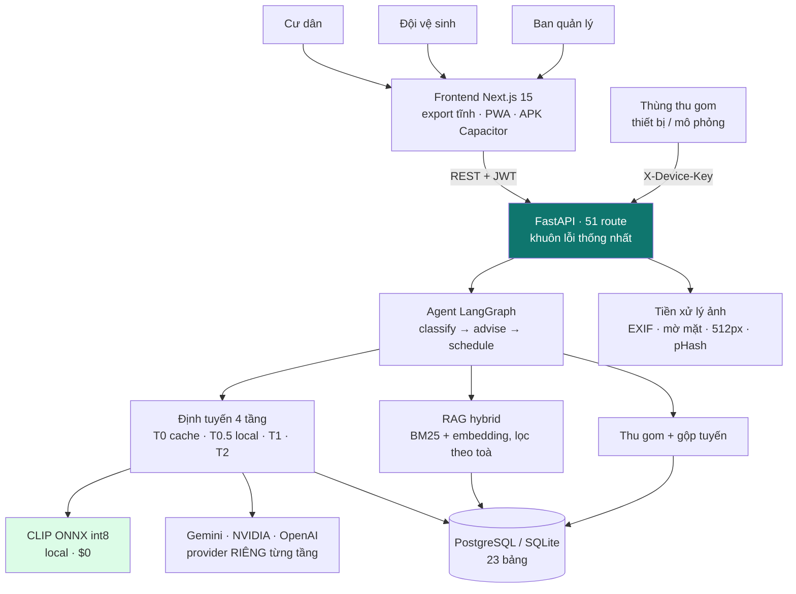
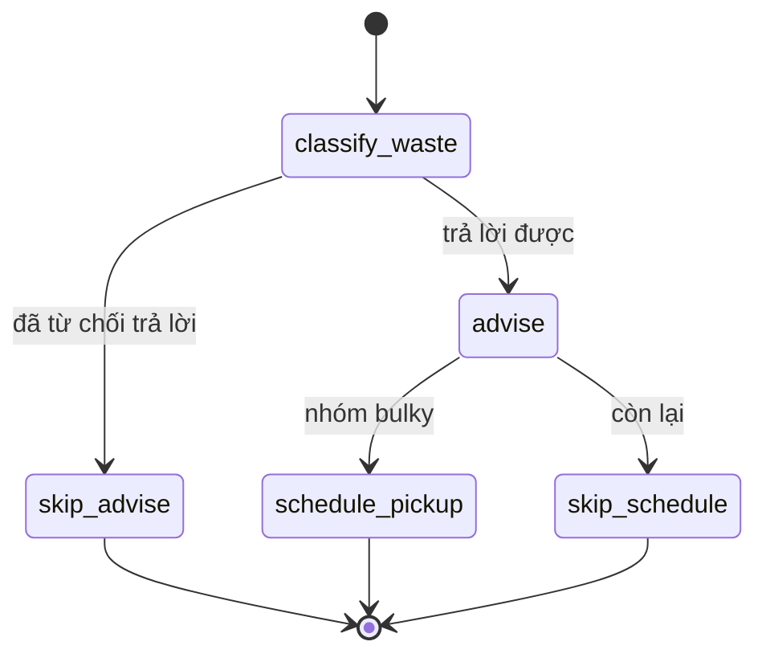
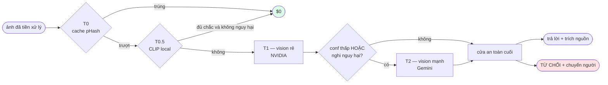

# Sơ đồ kiến trúc — GreenBin AI (VHR-17)

> 📖 **Tài liệu kiến trúc đầy đủ nằm ở [`../ARCHITECTURE.md`](../ARCHITECTURE.md)** —
> 22 mục, 14 sơ đồ, kèm số đo thật và danh sách giới hạn đã biết.
> File này là bản một trang để xem nhanh.

---

## 1. Toàn cảnh hệ thống

## 2. Luồng agent

Hai nhánh `skip_*` **vẫn ghi bản ghi node** với `status="skipped"` kèm lý do —
màn Agent Run nhìn thấy cả đường đã đi lẫn đường không đi.

## 3. Định tuyến model 4 tầng

## 4. Ba điểm HITL

| # | Điểm | Ai duyệt | Kích hoạt khi |
|---|---|---|---|
| 1 | Yêu cầu thu gom | Ban quản lý | trên 30 kg · trên 3 món · **có món nguy hại** |
| 2 | Nhãn phân loại | Đội vệ sinh + BQL | confidence thấp · nghi nguy hại |
| 3 | Tuyến agent đề xuất | Đội trưởng / BQL | **luôn luôn** — agent không tự đổi lịch làm việc của người |

## 5. Thành phần

| Thành phần | Công nghệ | Vai trò |
|---|---|---|
| Frontend | Next.js 15 · Tailwind v4 · `output: "export"` | 3 vai trò · PWA · APK Capacitor |
| Backend | FastAPI + SQLAlchemy 2.x | 51 route · khuôn lỗi `{error:{code,message_vi}}` |
| Agent | LangGraph `StateGraph` | `classify → advise → schedule` có trace |
| Model | Gemini · NVIDIA · OpenAI-compatible · **CLIP ONNX local** | provider khai **riêng từng tầng** |
| CSDL | SQLite khi dev → PostgreSQL khi deploy | 23 bảng |
| Vector | JSON list trong SQLite → pgvector | truy hồi **hybrid** BM25 + embedding |
| Ảnh | Pillow + OpenCV + imagehash | tước EXIF · làm mờ mặt · nén · pHash |
| Triển khai | Render (Docker + Postgres) + Vercel | 512 MB RAM là ràng buộc thiết kế |
