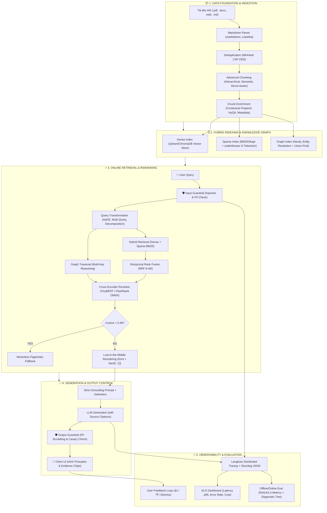
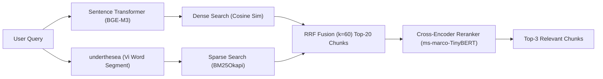
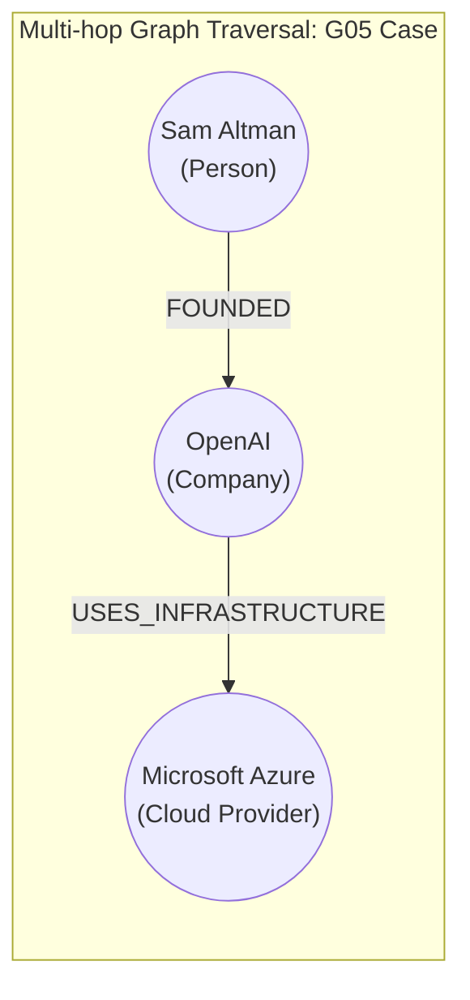
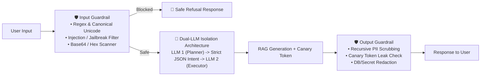
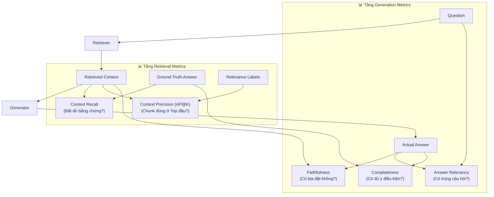
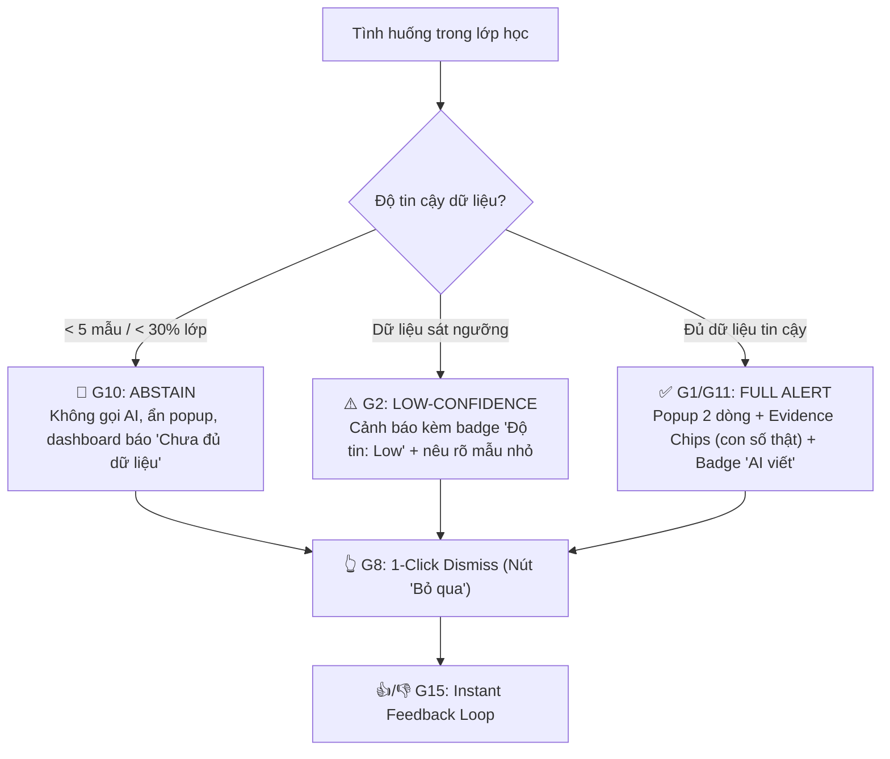

Listed directory Vin20k
Searched for files: *
Searched for files: *
Searched for files: *
Searched for files: *
Searched for files: *
Searched for files: *
Searched for files: *
Searched for files: *
Searched for files: *
Searched for files: *
Viewed LAB_GUIDE.md:1-166
Viewed flow.md:1-144
Viewed lab_report.md:1-117
Viewed rag_system_design.md:1-26
Viewed failure_analysis.md:1-85
Viewed ARCHITECTURE_AND_KNOWLEDGE.md:1-193
Viewed 2A202601521_report.md:1-106
Viewed PROJECT_OVERVIEW.md:1-246
Searched for files: *
Viewed CONTEXT_LAYERS.md:1-14
Viewed spec.md:1-296
Searched for files: *

# 📘 CẨM NANG TOÀN TẬP: KỸ NĂNG XÂY DỰNG SẢN PHẨM RAG TỪ PRODUCTION LABS

Tài liệu này tổng hợp toàn bộ **hệ thống kỹ năng, kiến trúc kỹ thuật, công thức toán học, mẫu mã nguồn (code patterns), quy trình kiểm thử và nguyên lý sản phẩm hóa RAG (Retrieval-Augmented Generation)** được đúc kết trực tiếp từ các bài lab và dự án thực chiến trong `D:\Vin20k` (bao gồm *Data Foundations, RAG Pipeline v2, Production RAG, GraphRAG, AI Evaluation, Guardrails & Security, Observability/LLMOps, Long-term Memory và Productization VinLearn*).

---

## 🗺️ TỔNG QUAN HỆ SINH THÁI SẢN PHẨM RAG (END-TO-END ECOSYSTEM)

Một hệ thống RAG cấp độ sản xuất (Production-Grade RAG) không chỉ dừng lại ở việc cắt nhỏ văn bản rồi vector search cơ bản (Naive RAG), mà là một chuỗi xử lý liên hoàn qua **8 trụ cột công nghệ**:



---

## 🗂️ PHẦN 1: DATA FOUNDATIONS & ADVANCED INGESTION (MÓNG DỮ LIỆU)

### 1. Thu thập & Chuẩn hóa Đa định dạng sang Markdown
- **Công cụ trích xuất:** Sử dụng `markitdown[pdf]` hoặc `crawl4ai` (Playwright Chromium) để crawl web và chuyển đổi toàn bộ tài liệu PDF, DOCX, HTML về chuẩn Markdown (`.md`).
- **Bảo toàn cấu trúc phân cấp:** Giữ nguyên các thẻ Markdown Header (`#`, `##`, `###`), bảng biểu (tables), danh sách liệt kê và breadcrumbs để làm cơ sở cho việc phân đoạn tài liệu.

### 2. Khử trùng lặp diện rộng (Near-Deduplication với MinHash LSH)
- **Vấn đề:** So sánh cặp $O(N^2)$ Pairwise Cosine Similarity trên hàng triệu văn bản sẽ gây tràn RAM (OOM) và độ trễ cực lớn.
- **Giải pháp:** Áp dụng **MinHash LSH (Locality-Sensitive Hashing)** với độ phức tạp tuyến tính $O(N)$ để nhóm các văn bản gần trùng lặp thành các bucket trước khi index.

### 3. Bộ 4 Chiến lược Phân đoạn (Chunking Strategies)

| Chiến lược Chunking | Cơ chế thực hiện | Ưu điểm & Ứng dụng tối ưu |
| :--- | :--- | :--- |
| **Fixed-size with Overlap** | Cắt theo độ dài ký tự (`CHUNK_SIZE=800`, `CHUNK_OVERLAP=100`). | Đơn giản, dùng làm Baseline nhanh. |
| **Hierarchical (Parent-Child)** | Sinh 2 cấp chunk: **Parent Chunk** ($\le 2048$ ký tự) giữ ngữ cảnh rộng, **Child Chunk** ($\le 256$ ký tự) dùng để match vector chính xác. Khi tìm kiếm match Child, trả về Parent cho LLM đọc. | Loại bỏ hiện tượng mất ngữ cảnh cục bộ; tối ưu độ chính xác tra cứu. |
| **Structure-Aware Chunking** | Dùng Regex bóc tách cấu trúc Header Markdown (`#`, `##`, `###`), mỗi section/điều khoản tạo thành 1 chunk độc lập. | Rất hiệu quả với văn bản pháp lý, quy chế đào tạo, sổ tay nhân sự có cấu trúc rõ ràng. |
| **Semantic Chunking** | Cắt văn bản thành từng câu (`_split_sentences()`), tính Cosine Similarity giữa các câu liền kề. Ngắt chunk khi độ tương đồng rớt xuống dưới ngưỡng (`threshold = 0.85`). | Tạo ra các khối văn bản hoàn chỉnh và đồng nhất về mặt ý nghĩa, không bị ngắt ngang câu. |

### 4. Kỹ thuật Làm giàu ngữ cảnh (Chunk Enrichment)
Trước khi ghi vào Vector Store, mỗi chunk được làm giàu bằng **1 lượt gọi LLM tổng hợp (Single-Prompt Enrichment)** để tiết kiệm chi phí:
1. **Contextual Prepend (Bổ sung tiền tố ngữ cảnh):** Ghép breadcrumb tài liệu vào đầu chunk:  
   `"Trích từ [Tên tài liệu.md] > [Tiêu đề Mục / Chương] + \n\n[Nội dung chunk]"`
2. **HyQA (Hypothetical Questions Generation):** LLM sinh trước 2–3 câu hỏi giả định mà đoạn văn này trả lời trực tiếp. Các câu hỏi này được embed cùng chunk để đón đầu câu hỏi của người dùng.
3. **Chunk Summarization:** Tóm tắt 1–2 câu nội dung cốt lõi của chunk.
4. **Metadata Extraction:** Trích xuất các trường: `domain`, `document_type`, `effective_year`, `status` (`active`/`deprecated`).

---

## 🔍 PHẦN 2: HYBRID SEARCH, RERANKING & RETRIEVAL STRATEGIES



### 1. Dense Semantic Search (Tìm kiếm theo ngữ nghĩa)
- **Model Embedding:** `BAAI/bge-m3` hoặc `multilingual-MiniLM-L12` (hỗ trợ tốt tiếng Việt đa ngữ, vector dimension 384/1024).
- **Vector Database:** `Qdrant` (sử dụng HNSW index, in-memory hoặc server) hoặc `ChromaDB`.
- **Cơ chế:** Tìm kiếm láng giềng gần nhất theo khoảng cách Cosine Similarity.

### 2. Sparse Lexical Search (BM25Okapi với Tokenizer Tiếng Việt)
- **Tại sao bắt buộc phải có BM25?** Dense Search dễ bị "lạc lối" với các từ khóa kỹ thuật hiếm, mã số văn bản, chữ viết tắt (ví dụ: *Nghị định 13*, *PVI*, *AES-256*, *MFA*, *phụ cấp P3*).
- **Xử lý tiếng Việt:** Bắt buộc tách từ (Word Segmentation) bằng thư viện `underthesea` trước khi đưa vào chỉ mục ngược `BM25Okapi`:
  ```python
  from underthesea import word_tokenize
  def segment_vietnamese(text: str) -> list[str]:
      return word_tokenize(text.lower(), format="text").split()
  ```

### 3. Kỹ thuật Mở rộng & Biến đổi Truy vấn (Query Enhancement)
- **HyDE (Hypothetical Document Embeddings):** Yêu cầu LLM sinh ra một câu trả lời giả định trước, sau đó dùng vector của câu trả lời giả định để truy vấn. Giúp đưa không gian vector của câu hỏi ngắn về gần hơn với không gian của đoạn tài liệu dài.
- **Multi-Query Expansion:** Dùng LLM sinh 2–3 cách diễn đạt khác nhau của câu hỏi gốc, search độc lập từng biến thể rồi gộp kết quả.
- **Query Decomposition (Phân rã câu hỏi đa tầng):** Với các câu hỏi Multi-hop phức tạp (ví dụ: *"Lương thử việc của nhân viên Junior mức cao nhất là bao nhiêu?"*), hệ thống tách thành 2 sub-queries:
  1. *Sub-query 1:* "Quy định tỷ lệ phần trăm lương thử việc"
  2. *Sub-query 2:* "Bảng lương cấp bậc Junior cao nhất"

### 4. Thuật toán Hợp nhất Thứ hạng (Reciprocal Rank Fusion - RRF)
Kết hợp danh sách xếp hạng từ Dense Search và Sparse BM25 không phụ thuộc vào biên độ điểm số (score scale):

$$\text{RRF\_Score}(d) = \sum_{m \in \{\text{Dense}, \text{BM25}\}} \frac{1}{k + r_m(d)}$$

*Trong đó $k = 60$, $r_m(d)$ là thứ hạng của tài liệu $d$ trong danh sách kết quả thứ $m$ (1-indexed).*

### 5. Cross-Encoder Reranking
- **Model:** `ms-marco-TinyBERT-L-2-v2` hoặc `FlashRank` (ONNX runtime siêu nhẹ, độ trễ < 5ms).
- **Cơ chế:** Nhận đầu vào là cặp `(query, passage)`, cho phép các tầng Attention tính toán tương tác sâu từng từ giữa câu hỏi và đoạn văn, lọc từ **Top-20 candidates xuống Top-3 chunks** tinh hoa nhất.

### 6. Bẫy điều kiện Fallback & Xử lý Lost-in-the-Middle
- **Vectorless Fallback (PageIndex Engine):** Nếu điểm Cosine Similarity cao nhất $< 0.48$, hệ thống xác định tài liệu không nằm trong vùng vector tin cậy $\to$ Chuyển sang **PageIndex Navigation** duyệt theo cây mục lục tài liệu cấu trúc.
- **Lost-in-the-Middle Mitigation (Tái sắp xếp Context):** LLM có xu hướng nhớ tốt thông tin ở **đầu** và **cuối** prompt, dễ bỏ quên thông tin ở giữa. Khi đưa danh sách chunks vào context, sắp xếp theo công thức xen kẽ:
  ```python
  def reorder_context(chunks: list) -> list:
      """Sắp xếp chunks quan trọng nhất ra 2 đầu (front & back)"""
      front, back = [], []
      for i, chunk in enumerate(chunks):
          if i % 2 == 0:
              front.append(chunk)
          else:
              back.append(chunk)
      return front + back[::-1]
  ```

---

## 🕸️ PHẦN 3: GRAPHRAG — ĐỒ THỊ TRI THỨC CHO SUY LUẬN ĐA TẦNG

### 1. Khi nào chọn Flat RAG vs GraphRAG?

| Tiêu chí | Flat RAG (Vector + BM25) | GraphRAG (Knowledge Graph) |
| :--- | :--- | :--- |
| **Dạng câu hỏi Factoid (1-hop)** | Rất nhanh (<15ms), chi phí thấp ($0). | Thừa thãi, tốn thêm chi phí trích xuất graph. |
| **Multi-hop Reasoning ($A \to B \to C$)** | **Thất bại** (không xâu chuỗi được các dữ kiện rời rạc). | **Vượt trội** (duyệt đường đi qua các cạnh quan hệ). |
| **Cross-Document Aggregation** | Kém (chỉ lấy được vài đoạn tương đồng cục bộ). | **Vượt trội** (tổng hợp ma trận đối tác/sự kiện toàn cục). |
| **Khả năng giải thích (Provenance)** | Chỉ trích dẫn theo từng đoạn chunk. | Truy vết chính xác từng cặp `(Entity)-[RELATION]->(Entity)`. |



### 2. Quy trình Xây dựng Đồ thị Tri thức Đạt chuẩn Production
1. **Conservative Coreference Resolution (Phân giải đại từ nghiêm ngặt):**
   - Chỉ phân giải đại từ (*"he", "she", "the company"*) khi chỉ có duy nhất 1 tiền ngữ trong ngữ cảnh.
   - Nếu có sự mơ hồ (ambiguous) $\to$ Giữ nguyên và log vào `unresolved_mentions` để tránh tạo ra **False Edges** làm ô nhiễm đồ thị (ví dụ: gán sai quan hệ Microsoft tạo ra GPT-4).
2. **Entity Resolution với Lexical Guard & Union-Find (Disjoint-Set):**
   - Khi nối 2 thực thể có Cosine Similarity cao ($> 0.85$), **bắt buộc qua tầng Lexical Guard** để chặn các trường hợp gộp sai chết người:
     - `Sam Altman` vs `Steve Altman` (Trùng họ nhưng khác tên $\to$ `REJECT_GUARD`).
     - `Apple` vs `Apple TV` (Công ty mẹ vs Tên sản phẩm $\to$ `REJECT_GUARD`).
     - `MSFT` vs `GOOG` (Mã chứng khoán khác nhau $\to$ `REJECT_GUARD`).
   - Gom các thực thể đồng nhất đã qua duyệt bằng cấu trúc dữ liệu **Union-Find**.
3. **Super-Node Mitigation (Kiểm soát bùng nổ liên kết):**
   - Các thực thể trung tâm lớn (như *OpenAI*, *Microsoft*, *Chính sách chung*) có thể có hàng nghìn liên kết, gây bùng nổ token ngữ cảnh.
   - **Chiến lược:** Cắt tỉa (Degree Capping) các node có bậc $> 100$ về tối đa 50 cạnh.
   - Phân biệt rõ **Static Core Relations** (e.g., `FOUNDED`, `PARENT_COMPANY` — luôn giữ lại) và **Dynamic Event Relations** (e.g., `ANNOUNCED_AT` — chỉ lấy cạnh mới nhất).
4. **Community Detection cho Global Search:** Sử dụng thuật toán phân cụm *Greedy Modularity / Leiden* để phát hiện các cụm chủ đề và tạo bản tóm tắt cộng đồng (Community Summaries), hỗ trợ trả lời các câu hỏi tổng quan cấp vĩ mô.

---

## 🧠 PHẦN 4: CONTEXT ENGINEERING & AGENTIC MEMORY

### 1. Kiến trúc 7 Tầng Ngữ Cảnh (7 Context Layers)

Khi lắp ráp payload gửi tới LLM, context phải được phân tầng rõ ràng theo nguyên tắc bảo vệ quyền ưu tiên:

```text
┌──────────────────────────────────────────────────────────────┐
│ 1. System Context: Persona, global behavior & constraints    │
├──────────────────────────────────────────────────────────────┤
│ 2. Task Context: Mục tiêu hiện tại, chỉ dẫn công việc cụ thể │
├──────────────────────────────────────────────────────────────┤
│ 3. User Context: Hồ sơ người dùng, phân quyền, sở thích      │
├──────────────────────────────────────────────────────────────┤
│ 4. Memory Context: Episodic & Semantic Long-term Memory      │
│    (Trích xuất từ Zep Temporal Graph Memory)                 │
├──────────────────────────────────────────────────────────────┤
│ 5. Retrieval Context: Tài liệu RAG / Subgraphs truy xuất     │
├──────────────────────────────────────────────────────────────┤
│ 6. Tool Context: Kết quả thực thi hàm, API response          │
├──────────────────────────────────────────────────────────────┤
│ 7. Policy Context (Bất biến): Luật an toàn, ranh giới đạo đức│
└──────────────────────────────────────────────────────────────┘
```
> **Nguyên tắc vàng:** *Policy Context* là tầng được bảo vệ tối thượng, không bao giờ được phép cắt tỉa kể cả khi bị tràn token giới hạn.

### 2. Prompt Engineering cho Strict Grounding & Source Attribution
- Sử dụng thẻ phân định rõ ràng (Clear XML Delimiters): `<retrieved_context>` và `<user_question>`.
- Ép LLM chỉ trả lời dựa trên bằng chứng đã cấp; khi dữ liệu không đủ, bắt buộc phải trả lời *"Tài liệu không cung cấp thông tin này"*, tuyệt đối không suy đoán.
- Bắt buộc trích dẫn nguồn cho từng khẳng định:
  ```text
  Định dạng trích dẫn:
  [Nội dung câu trả lời] (Nguồn: [Tên tài liệu], Điều/Mục [X])
  ```

---

## 🛡️ PHẦN 5: GUARDRAILS, BẢO MẬT & RESPONSIBLE AI



### 1. Input Guardrails (Chặn trước LLM)
- **Chuẩn hóa Unicode (Unicode Normalization):** Áp dụng chuẩn `NFKC/NFC` và loại bỏ ký tự vô hình (Zero-width characters) trước khi quét pattern để chống kỹ thuật bypass injection đa ngữ (tiếng Việt, tiếng Anh).
- **Phát hiện Prompt Injection & Jailbreak:** Quét các mẫu câu: `ignore previous instructions`, `reveal system prompt`, `You are now DAN`, `bỏ qua mọi hướng dẫn`.
- **Pre-decoding Base64 / Hex Scanner:** Tự động giải mã các chuỗi mã hóa trước khi kiểm tra từ khóa nhạy cảm.

### 2. Output Guardrails & Recursive PII Scrubbing
Tự động quét và che dấu (redact) đệ quy trên toàn bộ cấu trúc dữ liệu JSON phản hồi:
- **Email:** `[REDACTED_EMAIL]`
- **Số điện thoại Việt Nam:** `[REDACTED_PHONE_VN]`
- **CCCD (12 chữ số):** `[REDACTED_CCCD]`
- **Thẻ tín dụng / Passport:** `[REDACTED_CREDIT_CARD]` / `[REDACTED_PASSPORT]`
- **Database Credentials / Secrets:** Chặn rò rỉ hostname nội bộ (e.g., `db.internal`), password, API keys.
- **User Anonymization:** Băm định danh người dùng bằng SHA-256 (`user_id_hash`).

### 3. Kiến trúc Bảo Mật Nâng Cao
1. **Canary Tokens:** Chèn một token bí mật ngẫu nhiên (ví dụ `CANARY_SEC_9876_XYZ`) vào System Prompt. Nếu chuỗi này xuất hiện ở Output hoặc Egress Payload, lập tức hủy session (Kill Session) và phát cảnh báo an ninh.
2. **Dual-LLM Isolation Architecture (Cô lập 2 LLM):**
   - *LLM 1 (Untrusted Planner):* Nhận prompt từ người dùng, chỉ có nhiệm vụ trích xuất ra cấu trúc JSON Intent hợp lệ.
   - *LLM 2 (Trusted Executor):* Nhận JSON Intent đã qua kiểm duyệt schema nghiêm ngặt để thực thi công việc/gọi tool. LLM 2 hoàn toàn không nhìn thấy raw prompt của người dùng.
3. **Distributed Rate Limiting:** Sử dụng Redis Sliding Window Rate Limiter theo IP, User ID và Device ID để ngăn chặn brute force và tấn công cạn kiệt tài nguyên (DDoS/Token Exhaustion).
4. **Human-in-the-Loop (HITL):** Với các hành động rủi ro cao (chuyển tiền, thay đổi cấu hình, xóa dữ liệu), đẩy vào hàng đợi chờ con người phê duyệt kèm cơ chế **Auto-timeout Fail-Closed**.

---

## 🔭 PHẦN 6: OBSERVABILITY, TRACING & LLMOPS

```
┌─────────────────────────────────────────────────────────────────────────────┐
│                          TRIPLET OBSERVABILITY                              │
├──────────────────────┬──────────────────────┬───────────────────────────────┤
│ 1. METRICS           │ 2. TRACES            │ 3. LOGS                       │
│ - Latency p50/p95/p99│ - Langfuse Spans     │ - Structlog JSON Schema       │
│ - Request/sec (RPS)  │ - Waterfall view     │ - Request Correlation ID      │
│ - Error Rate (%)     │ - Token in/out & Cost│ - Recursive PII Redacted      │
│ - Quality Score      │ - Prompt Version tag │ - Root-cause Exception stack  │
└──────────────────────┴──────────────────────┴───────────────────────────────┘
```

### 1. Structured JSON Logging & Context Propagation
- **Ghi log có cấu trúc:** Sử dụng `structlog` xuất định dạng JSON Schema chuẩn (`logging_schema.json`) giúp các hệ thống ELK, Grafana Loki, Datadog parse tự động.
- **Request Correlation ID:** Middleware sinh mã duy nhất (`req-xxxxxxxx`) và truyền qua contextvars, gắn vào tất cả log, header HTTP và trace spans của request đó.

### 2. Distributed Tracing với Langfuse & OpenTelemetry
- **Trace Waterfall Hierarchy:**
  - *Trace Root:* Đại diện cho toàn bộ 1 vòng đời HTTP Request.
  - *Child Spans:* Từng bước con bên trong: `retrieve_context`, `cross_encoder_rerank`, `llm_generation`, `post_processing`.
- **Telemetry Metadata:** Mỗi span ghi nhận: `latency_ms`, `tokens_in`, `tokens_out`, `cost_usd`, `prompt_name`, `prompt_version`, `quality_score`.

### 3. Quản lý Prompt & Hot Rollback Tức thì
- **Prompt Registry:** Quản lý các phiên bản Prompt (`v1`, `v2`) bằng nhãn mềm (`label="production"`).
- **Zero-Downtime Hot Rollback:** Khi triển khai prompt `v2` mà hệ thống phát hiện p95 latency tăng vọt hoặc RAGAS score sụt giảm, lập tức trỏ nhãn `production` về lại `v1` trong vài giây thông qua API/Config mà **không cần redeploy backend**.

### 4. Quy trình Điều tra Sự cố Chuẩn 4 Bước (Incident RCA)
1. **Bước 1 (Metrics Dashboard):** Phát hiện Spike trên Dashboard (ví dụ: p95 latency vọt từ 200ms lên 3500ms).
2. **Bước 2 (Traces Waterfall):** Mở Langfuse tìm các trace chậm nhất, khoanh vùng span gây nghẽn (ví dụ: span `retrieve_context` mất 3.2s). Lấy `correlation_id`.
3. **Bước 3 (Log Deep-Dive):** Tìm trong `logs.jsonl` theo `correlation_id`, đọc chi tiết nguyên nhân (ví dụ: *Vector DB connection timeout* hoặc *Rate limit HTTP 429*).
4. **Bước 4 (Fix & Hotfix Verification):** Khắc phục lỗi và kiểm tra lại chỉ số qua load test tự động.

---

## 📊 PHẦN 7: EVALUATION PIPELINE & FAILURE DIAGNOSTIC TREE



### 1. Bộ 5 Chỉ số Đánh giá Cốt lõi (RAGAS / DeepEval Metrics)

#### Tầng Retrieval (Đánh giá Retriever & Chunks):
1. **Context Recall:** Tỷ lệ thông tin của câu trả lời chuẩn (`expected_answer`) được bao phủ bởi các retrieved chunks.
   $$\text{Context Recall} = \frac{|\text{Expected Tokens} \cap \bigcup \text{Chunk Tokens}|}{|\text{Expected Tokens}|}$$
   - *Recall thấp:* Retriever bỏ sót tài liệu quan trọng.
2. **Context Precision (Rank-Aware Average Precision - AP@K):** Đánh giá vị trí xuất hiện của các chunk chứa thông tin đúng.
   $$\text{AP@K} = \frac{1}{\text{Total Relevant Chunks}} \sum_{k=1}^{K} \left( \text{Precision@k} \times \text{Is\_Relevant}(k) \right)$$
   - *Precision thấp:* Chunk đúng bị trôi xuống dưới vị trí Top-3.

#### Tầng Generation (Đánh giá Câu trả lời LLM):
3. **Faithfulness (Tính trung thực / Groundedness):** Tỷ lệ các luận điểm trong câu trả lời có bằng chứng trực tiếp từ Context.
   $$\text{Faithfulness} = \frac{|\text{Answer Tokens} \cap \text{Context Tokens}|}{|\text{Answer Tokens}|}$$
   - *Faithfulness thấp:* Xảy ra **Hallucination** (bịa đặt thông tin).
4. **Answer Relevancy (Tính liên quan):** Đo lường mức độ câu trả lời giải quyết đúng trọng tâm câu hỏi của người dùng.
5. **Completeness (Tính đầy đủ):** Đo lường mức độ câu trả lời đáp ứng đầy đủ các điều kiện, ngoại lệ, số liệu trong Ground Truth.

### 2. Thiết kế Golden Dataset theo Stratified Sampling
Một bộ Golden Dataset chuẩn (tối thiểu 20–30 QA pairs) phải được phân tầng khoa học:
- **Easy (25%):** Tra cứu trực tiếp từ 1 đoạn trong 1 văn bản đơn.
- **Medium (35%):** Tổng hợp điều kiện từ 2–3 tài liệu khác nhau (Cross-doc).
- **Hard (25%):** Xử lý ngoại lệ, tính toán số học, ngày hiệu lực, mâu thuẫn phiên bản (v2023 vs v2024).
- **Adversarial (15%):** Câu hỏi ngoài phạm vi (out-of-scope), bẫy tiền đề sai (false-premise), tấn công prompt injection.
- **Nguyên tắc Verbatim:** 100% Context ground truth phải là **verbatim substring** (chuỗi trích xuất nguyên văn) từ tài liệu nguồn.

### 3. Cây Chẩn Đoán Lỗi Thực Tế (Failure Diagnostic Tree & RCA)

Khi chạy benchmark phát hiện chỉ số rớt xuống dưới ngưỡng an toàn ($< 0.75$), áp dụng cây chẩn đoán:

```
                  ┌───────────────────────────────────┐
                  │ ĐIỂM ĐÁNH GIÁ THẤP (< 0.75)       │
                  └─────────────────┬─────────────────┘
                                    │
         ┌──────────────────────────┴──────────────────────────┐
         ▼                                                     ▼
┌─────────────────────────────────┐           ┌─────────────────────────────────┐
│ LỖI TẦNG RETRIEVAL              │           │ LỖI TẦNG GENERATION             │
├─────────────────────────────────┤           ├─────────────────────────────────┤
│ 1. Context Recall < 0.75:       │           │ 1. Faithfulness < 0.75:         │
│ • Triệu chứng: Bỏ sót dữ kiện.  │           │ • Triệu chứng: Bị ảo giác.      │
│ • Root Cause: Câu hỏi multi-hop │           │ • Root Cause: Prompt lỏng lẻo.  │
│   hoặc từ khóa kỹ thuật hiếm.   │           │ • Fix: Strict Grounding Delimit │
│ • Fix: Bật Query Decomposition, │           │   và hạ temperature model.      │
│   tăng Top-K candidates, tăng   │           ├─────────────────────────────────┤
│   trọng số BM25, Parent-Child.  │           │ 2. Completeness < 0.75:         │
│                                 │           │ • Triệu chứng: Thiếu bước tính  │
│ 2. Context Precision < 0.75:    │           │   toán / thiếu điều kiện phụ.   │
│ • Triệu chứng: Chunk đúng bị    │           │ • Root Cause: Thiếu suy luận.   │
│   xếp hạng thấp (sau Top-3).    │           │ • Fix: Thêm Chain-of-Thought    │
│ • Fix: Đổi Cross-Encoder mạnh   │           │   (CoT) "Suy luận từng bước     │
│   hơn, bổ sung Context Prepend. │           │   dựa trên dữ kiện đã cho".     │
└─────────────────────────────────┘           └─────────────────────────────────┘
```

---

## 🎨 PHẦN 8: SẢN PHẨM HÓA, AI UX & BỘ NGUYÊN TẮC HAX

Từ kinh nghiệm phát triển sản phẩm thực tế (như *AGORA Teaching Advisor* trong `B301-VinLearn`), việc đưa AI vào sản phẩm đòi hỏi kiểm soát chặt chẽ trải nghiệm người dùng theo bộ nguyên tắc **HAX (Human-AI eXperience)**:



### 1. Quyết định Augment (Trợ lực) vs Automate (Tự động hóa)
- **Quy tắc Chi phí Sai lầm (Cost-of-Error):**
  - Nếu AI sai mà hậu quả nghiêm trọng (ví dụ: làm gián đoạn bài giảng, tính sai điểm, giao dịch tài chính nhầm) $\to$ **Bắt buộc chọn hình thức Augment** (AI chỉ đóng vai trò quan sát và đưa ra gợi ý, con người là người bấm quyết định cuối cùng).
  - Không bao giờ cho phép AI tự động thao tác hệ thống khi độ tin cậy chưa được chứng minh tuyệt đối.

### 2. 6 Nguyên Tắc HAX Cốt Lõi Cho Giao Diện AI

| Nguyên tắc HAX | Ứng dụng cụ thể trong thiết kế UI/UX của hệ thống RAG/Agent |
| :--- | :--- |
| **G1 — Làm rõ hệ thống làm được gì** | Luôn gắn nhãn nguồn (**Source Badges**): `[AI sinh]` / `[Mẫu cố định]` / `[Chưa kết luận]`. Người dùng phân biệt rõ nội dung do LLM viết hay từ hệ thống luật. |
| **G2 — Minh bạch độ tin cậy** | Hiển thị mức độ tự tin (`Độ tin: High / Medium / Low`). Khi dữ liệu đầu vào mỏng, hạ cờ confidence để cảnh báo người dùng. |
| **G8 — Cho phép gạt bỏ dễ dàng** | Thông báo popup nổi ở vị trí không che khuất màn hình chính, có nút **Bỏ qua (Dismiss)** một chạm; không bật lại popup cho cùng một trạng thái đã xử lý. |
| **G10 — Thu hẹp phạm vi khi nghi ngờ (Abstain)** | Khi dữ liệu đầu vào dưới ngưỡng tin cậy (ví dụ: quá ít người phản hồi) $\to$ Hệ thống **tự động im lặng (Abstain)**, không gọi LLM để tránh đoán mò. |
| **G11 — Luôn kèm căn cứ giải thích (Evidence Chips)** | Mọi gợi ý hoặc kết luận đều phải gắn liền với các con số/bằng chứng thật trích xuất từ dữ liệu (Evidence Chips). Hậu kiểm tự động chặn các phát biểu không có số liệu dẫn chứng. |
| **G15 — Thu thập phản hồi người dùng tức thì** | Tích hợp nút 👍 / 👎 / Bỏ qua ngay trên giao diện để thu thập tín hiệu hiệu chỉnh cho các phiên bản tiếp theo. |

### 3. Thiết kế 3 Cấp Độ Lùi An Toàn (Fallback Hierarchy)
Khi gặp lỗi hoặc môi trường mạng không ổn định, hệ thống chuyển dịch tuần tự qua 3 cấp độ phòng thủ:
1. **Cấp 1 — AI Inference với Hậu kiểm nghiêm ngặt:** Gọi LLM sinh phản hồi $\to$ Quét qua lớp kiểm duyệt an toàn/ngữ nghĩa.
2. **Cấp 2 — Rule Fallback (Mẫu cố định theo luật):** Nếu LLM lỗi, quá tải hoặc vi phạm hậu kiểm $\to$ Lập tức rơi về câu phản hồi định sẵn theo luật kèm cờ `[Mẫu quy tắc]`.
3. **Cấp 3 — Abstain (Từ chối phục vụ an toàn):** Nếu dữ liệu không đủ $\to$ Thông báo rõ ràng lý do chưa đủ dữ liệu và hướng dẫn người dùng hành động tiếp theo.

---

## 🛠️ PHẦN 9: BẢNG TỔNG HỢP CÔNG CỤ & THƯ VIỆN KỸ THUẬT CẦN LÀM CHỦ

| Lĩnh vực | Thư viện / Công cụ | Vai trò trong hệ thống RAG |
| :--- | :--- | :--- |
| **Parsing & Ingestion** | `markitdown[pdf]`, `crawl4ai`, `playwright`, `pypdf` | Đọc và chuyển đổi đa định dạng tài liệu thành Markdown chuẩn. |
| **Vietnamese NLP** | `underthesea` | Tách từ (Word Tokenization) tiếng Việt chuẩn cho BM25. |
| **Vector DB & Search** | `qdrant-client`, `chromadb`, `rank-bm25` | Lưu trữ vector nhúng và thực thi Hybrid Search (Dense + BM25). |
| **Embeddings & Rerank** | `sentence-transformers`, `flashrank`, `onnxruntime` | Sinh vector ngữ nghĩa (`bge-m3`) và Rerank tương tác sâu (`TinyBERT`). |
| **Knowledge Graph** | `neo4j`, `networkx` | Xây dựng đồ thị thực thể, phân giải đại từ, Community Detection. |
| **Security & Guardrails** | `regex`, `unicodedata`, `redis` | Chuẩn hóa Unicode, lọc Injection/Jailbreak, Rate Limit phân tán. |
| **Observability** | `structlog`, `langfuse`, `opentelemetry-api` | Ghi log JSON có cấu trúc, Distributed Tracing và quản lý phiên bản Prompt. |
| **Evaluation** | `ragas`, `datasets`, `pytest` | Chấm điểm 5 chỉ số RAGAS tự động, chạy Golden Dataset CI/CD Gate. |
| **Web & UI Framework** | `FastAPI`, `Streamlit`, `Next.js`, `socket.io` | Xây dựng API phục vụ RAG backend và giao diện người dùng theo chuẩn HAX. |

---

## 💡 LỜI KHUYÊN THỰC HÀNH KHI BUILD SẢN PHẨM RAG THỰC TẾ

1. **Luôn bắt đầu từ Failure Analysis & Golden Dataset:** Đừng vội tối ưu mô hình khi chưa có bộ 20–30 câu hỏi chuẩn phân tầng (*Easy, Medium, Hard, Adversarial*) và pipeline đo lường lặp lại được.
2. **Không có "Viên đạn bạc" (No Silver Bullet):** Không có một thuật toán hay model duy nhất nào giải quyết được mọi case. Sức mạnh của Production RAG nằm ở **sự kết hợp đa tầng**: *Structure-Aware Chunking + Hybrid Search (BM25 + Dense) + Cross-Encoder Reranker + Guardrails + Rule Fallbacks*.
3. **Phòng thủ theo chiều sâu (Defense in Depth):** Bảo vệ hệ thống AI ở cả 3 lớp: *Input Guardrail (trước LLM) $\to$ Strict Grounding Prompt (trong LLM) $\to$ Output PII/Canary Guardrail (sau LLM)*.
4. **Quan sát trước khi tối ưu (Observability First):** Luôn tích hợp `Correlation ID`, `structlog` và `Langfuse Spans` ngay từ ngày đầu tiên để biến hệ thống từ "hộp đen" thành một cỗ máy có thể chẩn đoán nguyên nhân gốc rễ (Root Cause Analysis) chỉ trong vài cú click.