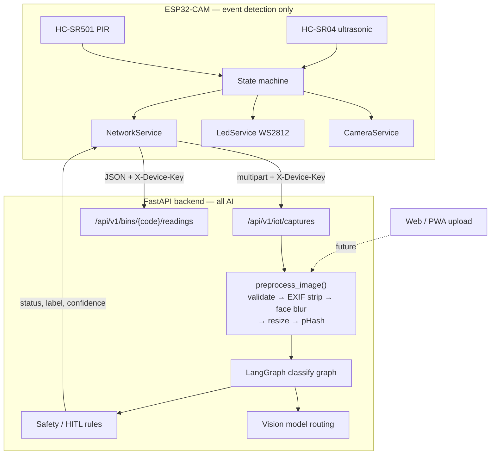

# IoT subsystem architecture

## Where the intelligence lives

The device detects events and captures images. It runs no classification model.
Every model call happens on the backend, behind the privacy pipeline.



The dotted line matters: the privacy pipeline is positioned so a future web
upload path joins *above* it, not beside it. There is one preprocessing step and
one classifier for all image sources.

## Firmware layering

```
src/core/   pure logic — no Arduino.h, compiles and tests on the desktop
src/hw/     thin drivers — pins, HTTP, NeoPixel, esp_camera
src/main.cpp  wiring only
```

`src/core/state_machine.cpp` depends on five interfaces declared in
`core/hal.h` — `PresenceSensor`, `DistanceSensor`, `CameraService`,
`NetworkService`, `LedService` — and receives the current time as a parameter
rather than calling `millis()`.

Three things follow from that:

1. **All nine specification scenarios run as desktop unit tests** with fakes, in
   under a second, with no hardware and no network.
2. **A future ESP32-S3 port touches `src/hw/` only.** The event logic, thresholds
   and retry bounds move unchanged.
3. **Simulation can swap the camera.** `MockCameraService` returns a fixture JPEG
   so the capture→upload→classify→LED path is exercisable where Wokwi cannot
   simulate the OV2640.

The `native` PlatformIO environment compiles `src/core/` alone, which enforces the
layering: a stray `#include <Arduino.h>` in core code breaks the test build
immediately.

## Backend modules added

| Module | Responsibility |
|---|---|
| [`src/api/iot.py`](../../src/api/iot.py) | HTTP only — auth, parsing, status codes |
| [`src/services/image_privacy.py`](../../src/services/image_privacy.py) | Validate, strip EXIF, blur faces, resize, pHash |
| [`src/services/classification.py`](../../src/services/classification.py) | Entry point; accepts `ProcessedImage`, never raw bytes |
| [`src/agents/classify_graph.py`](../../src/agents/classify_graph.py) | LangGraph: `vision → safety → END` |
| [`src/agents/nodes/classify_nodes.py`](../../src/agents/nodes/classify_nodes.py) | Model call and reply parsing |
| [`src/services/vision.py`](../../src/services/vision.py) | Provider routing; the only place a provider is chosen |
| [`src/services/safety.py`](../../src/services/safety.py) | Confidence threshold, hazard labels, HITL flags |
| [`src/services/device_auth.py`](../../src/services/device_auth.py) | `X-Device-Key` verification |
| [`src/services/bin_readings.py`](../../src/services/bin_readings.py) | Reading validation and storage behind a repository interface |

Existing modules were extended, not replaced: `src/config.py` gained IoT settings,
`src/models/schemas.py` gained the IoT schemas, `src/main.py` mounts one extra
router. `POST /api/v1/chat` and its graph are untouched.

## Safety properties, and how they are enforced

| Property | Enforcement |
|---|---|
| No image reaches a provider unprocessed | `classify_processed_image()` takes `ProcessedImage`; there is no `bytes` overload |
| No Vision key on the device | The device's entire credential set is Wi-Fi + backend URL + id + device key |
| PIR alone never causes a model call | `VERIFY_OBJECT` requires an ultrasonic delta before `CAPTURE` |
| Uncertainty is never presented as success | `parseStatus()` maps unknowns to `Unknown`; `ledPatternFor()` gives it the warning pattern; `isConclusive()` gates label display |
| Errors never wedge the device | Bounded `RetryPolicy`, and `ERROR` always exits to `IDLE` |
| Camera buffers cannot leak | Every exit path routes through `releaseFrameIfHeld()` |
| No repeated bin-full spam | `BinFullTracker` emits on transitions only, with hysteresis |

## Known limitations

- **Bin readings are stored in memory** and do not survive a restart. The
  repository interface is the swappable part; a SQLAlchemy implementation is the
  intended follow-up.
- **`HTTPClient` is synchronous.** `UPLOAD` and `WAIT_RESULT` are distinct states,
  but the underlying request blocks for up to `HTTP_TIMEOUT_MS`. The device is
  unresponsive to PIR during an upload. Acceptable for Phase 1; an async client or
  a second task would fix it.
- **`Hcsr04DistanceSensor::read()` blocks** for up to ~270 ms (3 samples × echo
  timeout + settle).
- **Only OpenAI is wired as a Vision provider.** `langchain-gemini` is installed
  in this environment but ships as an empty stub with no chat class.
- **Face blurring depends on OpenCV < 5.** OpenCV 5 removed `CascadeClassifier`
  and ships no bundled face model; the requirement is pinned accordingly. If
  OpenCV is missing entirely, `faces_blurred` reports `null` and a warning is
  logged — the step is never silently skipped.
