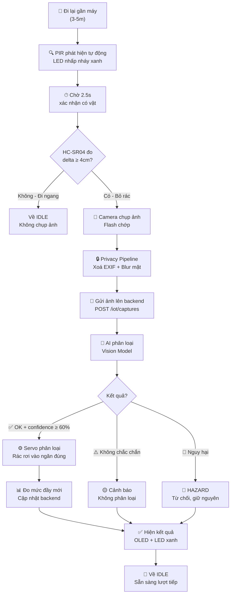

# 🗑️ Kế Hoạch Trải Nghiệm Người Dùng — Thùng Rác Thông Minh GreenBin AI

> **Dự án:** GreenBin AI IoT — Máy phân loại rác tự động bằng trí tuệ nhân tạo  
> **Phiên bản:** v1.0 · Ngày lập: 23/08/2026  
> **Mục đích:** Mô tả chi tiết trải nghiệm người dùng từ lúc tiếp cận thiết bị đến khi hoàn tất bỏ rác, kèm minh hoạ hình ảnh chân thật và ví dụ các loại rác cụ thể.

---

## 📋 Tổng Quan Hệ Thống

GreenBin AI là thiết bị thùng rác thông minh có khả năng **tự động phát hiện người dùng**, **chụp ảnh rác**, **phân loại bằng AI**, và **phân luồng vào đúng ngăn chứa** — toàn bộ quy trình diễn ra tự động, người dùng chỉ cần bỏ rác vào máy.


### Cấu trúc 4 tầng của máy

| Tầng | Thành phần | Vai trò |
|------|-----------|---------|
| **Tầng 1** | HC-SR501 PIR + ESP32-CAM + OLED + WS2812 LED | Phát hiện người dùng, chụp ảnh rác, hiển thị kết quả |
| **Tầng 2** | Servo 1 (chính) | Phân luồng rác sang TRÁI (plastic/metal) hoặc PHẢI (paper/other) |
| **Tầng 3** | Servo 2 + Servo 3 (phụ) | Phân loại chi tiết: TRÁI→plastic/metal, PHẢI→paper/other |
| **Tầng 4** | 4 ngăn chứa + 4 cặp HC-SR04 | Thu gom rác đã phân loại + đo mức đầy tự động |

---

## 🚶 Bước 1 — Người Dùng Tiếp Cận Máy

> **Trạng thái máy:** `IDLE` · LED: tắt/sáng nhẹ · Màn OLED: "Ready"

Người dùng đang cầm rác (chai nhựa, lon nhôm, giấy...) đi ngang qua khu vực đặt máy. Máy được đặt tại vị trí dễ nhìn thấy trong khuôn viên trường học, trung tâm thương mại, hoặc toà nhà văn phòng.


### Điều gì xảy ra ở phía máy?

- Máy đang ở trạng thái **chờ** (`IDLE`), các cảm biến PIR liên tục quét vùng phía trước.
- Cảm biến siêu âm HC-SR04 ở tầng 4 vẫn **đo mức đầy nền** mỗi 5 phút (`FILL_INTERVAL_MS = 300000ms`) — hoạt động hoàn toàn độc lập, không chặn luồng chính.
- Đèn LED WS2812 có thể hiện trạng thái nền: nếu có ngăn nào đầy trên 80%, LED sáng đỏ cố định (background state).

### Người dùng cần làm gì?

**Không cần làm gì** — chỉ cần đi lại gần máy. Không cần bấm nút, không cần quét mã.

---

## 🔍 Bước 2 — PIR Phát Hiện Có Người (Tự Động)

> **Trạng thái máy:** `IDLE → PRESENCE_DETECTED` · LED: nhấp nháy xanh lá · Màn OLED: "Hello! / User detected"

Khi người dùng bước vào bán kính cảm biến PIR (~3–5 mét), máy **tự động phát hiện** mà người dùng không cần thao tác gì.


### Cơ chế kỹ thuật

```
PIR HIGH → PRESENCE_DETECTED
  └─ chờ PIR_WAIT_MS (2500ms) để người dùng có thời gian tiến sát
  └─ → VERIFY_OBJECT
       └─ HC-SR04 đo khoảng cách TRƯỚC và SAU
       └─ delta = baseline - after
       └─ delta ≥ 4cm (OBJECT_DELTA_CM) → xác nhận có vật → CAPTURE
       └─ delta < 4cm → người đi ngang, không có rác → về IDLE
```

> [!IMPORTANT]
> **PIR đơn lẻ KHÔNG BAO GIỜ kích hoạt chụp ảnh.** Luôn cần cảm biến siêu âm xác nhận có vật thể mới rơi vào (khoảng cách đo được giảm ≥ 4cm). Điều này tránh chụp ảnh liên tục khi có người đi ngang.

### Người dùng cần làm gì?

**Chỉ cần đứng trước máy** và chuẩn bị bỏ rác vào lỗ nhập rác. Màn hình OLED sẽ chào đón.

---

## 🧴 Bước 3 — Bỏ Rác Vào Máy (Các Ví Dụ Minh Hoạ)

> **Trạng thái máy:** `VERIFY_OBJECT → CAPTURE` · Đèn flash chớp · OLED: "Capturing…"

Đây là bước **người dùng tương tác chính** — đưa rác vào lỗ nhập rác hình tròn trên thân máy.

### Ví dụ 1: Chai nhựa PET (Plastic)


- **Loại rác:** Chai nước Aquafina / Lavie / bất kỳ chai PET nào
- **Kết quả mong đợi:** `label = plastic`, `confidence ≈ 0.90–0.95`, `route = plastic`
- **Servo sẽ:** Nghiêng TRÁI (plastic/metal) → Servo 2 đẩy vào ngăn PLASTIC

### Ví dụ 2: Lon nhôm (Metal)


- **Loại rác:** Lon nước ngọt Coca-Cola / Pepsi / bia nhôm đã sử dụng
- **Kết quả mong đợi:** `label = metal` hoặc `can`, `confidence ≈ 0.88–0.94`, `route = metal`
- **Servo sẽ:** Nghiêng TRÁI (plastic/metal) → Servo 2 đẩy vào ngăn METAL

### Ví dụ 3: Giấy / Bìa carton (Paper)


- **Loại rác:** Giấy A4 đã sử dụng / báo cũ / hộp carton nhỏ
- **Kết quả mong đợi:** `label = paper` hoặc `cardboard`, `confidence ≈ 0.85–0.92`, `route = paper`
- **Servo sẽ:** Nghiêng PHẢI (paper/other) → Servo 3 đẩy vào ngăn PAPER

### Sơ đồ phân luồng servo (cây nhị phân 2 tầng)

```
                    route (AI quyết định)
                       │
         ┌─────────────┴─────────────┐
    plastic/metal                paper/other
         │                             │
    Servo 1 = TRÁI                Servo 1 = PHẢI
         │                             │
    ┌────┴────┐                  ┌─────┴─────┐
 plastic     metal              paper       other
 Servo2=T    Servo2=P           Servo3=T    Servo3=P
  Ngăn 1     Ngăn 2             Ngăn 3      Ngăn 4
```

---

## 📸 Bước 4 — Camera Chụp Ảnh Rác (Tự Động)

> **Trạng thái máy:** `CAPTURE → UPLOAD` · Flash chớp sáng · OLED: "Capturing…"

Ngay khi cảm biến siêu âm xác nhận có vật rơi vào, ESP32-CAM **tự động chụp ảnh JPEG** của rác bên trong chute.


### Pipeline xử lý ảnh (Privacy Pipeline)

Ảnh **KHÔNG ĐƯỢC gửi nguyên bản** cho AI. Trước khi gửi, hệ thống chạy pipeline bảo mật:

```
Ảnh gốc (JPEG từ OV2640)
  ├─ 1. Validate: kiểm tra file hợp lệ, kích thước < giới hạn
  ├─ 2. Strip EXIF: xoá toàn bộ metadata (GPS, device info…)
  ├─ 3. Face Blur: phát hiện & làm mờ mặt người (Haar cascade)
  ├─ 4. Resize: co về ≤ 1024px cạnh dài
  └─ 5. pHash: tạo perceptual hash để chống trùng lặp
       → ProcessedImage (gửi cho AI)
```

> [!NOTE]
> **Bảo mật quyền riêng tư:** Nếu người dùng vô tình đưa mặt vào khung hình, hệ thống **tự động làm mờ** trước khi AI nhìn thấy. Không có ảnh nào chứa khuôn mặt rõ ràng được gửi đi.

### Người dùng cần làm gì?

**Không cần làm gì** — đèn flash chớp sáng 1 lần, quá trình diễn ra trong ~1 giây.

---

## 🤖 Bước 5 — AI Phân Loại (Tự Động, Gọi Backend Thật)

> **Trạng thái máy:** `UPLOAD → WAIT_RESULT` · LED: nhấp nháy vàng · OLED: "Analyzing…"

Ảnh đã qua xử lý được gửi tới backend FastAPI qua HTTP POST multipart.


### Request gửi đi

```
POST /api/v1/iot/captures
Headers: X-Device-Key: <device-key>
Body (multipart/form-data):
  - image: <processed JPEG>
  - device_id: GBIN-001
  - bin_code: BIN-01
  - event_type: waste_detected
```

### Response nhận về (ví dụ)

```json
{
  "status": "ok",
  "label": "recyclable_plastic",
  "confidence": 0.94,
  "route": "plastic",
  "review_required": false,
  "message": "Chai nhựa PET — phân loại vào ngăn nhựa",
  "capture_id": "cap-2026-08-23-001"
}
```

### Quy tắc an toàn (Safety Rules)

| Điều kiện | Kết quả | LED |
|-----------|---------|-----|
| `confidence ≥ 0.60` + nhãn rõ ràng | `status = ok` → **phân loại** | 🟢 Xanh lá |
| `confidence < 0.60` | `status = warning` → **không phân loại** | 🟡 Vàng nhấp nháy |
| Nhãn thuộc nhóm nguy hại (battery, chemical…) | `status = hazard` → **từ chối** | 🔴 Đỏ nhấp nháy nhanh |
| Backend từ chối / lỗi | `status = refused` | 🟠 Cam |

> [!WARNING]
> **Nhóm rác nguy hại luôn được ưu tiên báo trước ngưỡng confidence.** Ví dụ: AI nhận diện "battery" với confidence chỉ 0.42 (dưới ngưỡng 0.60) → vẫn báo `hazard`, **KHÔNG** báo `warning`. An toàn hơn là cẩn thận.

---

## ✅ Bước 6 — Hiển Thị Kết Quả & Phân Loại Tự Động

> **Trạng thái máy:** `SORTING → UPDATE_FILL → SHOW_RESULT` · LED: xanh lá cố định · OLED: "PLASTIC / Accepted / Fill: 53%"

Khi AI trả kết quả thành công, máy hiển thị kết quả và servo tự động phân luồng rác.


### Trình tự phân loại cơ khí

```
SORTING:
  ├─ resolveSorting() kiểm tra: status=ok + nhãn hợp lệ + confidence ≥ 0.60?
  │   ├─ CÓ → Servo 1 nghiêng theo route (TRÁI hoặc PHẢI)
  │   │        Servo 2/3 chọn ngăn cụ thể
  │   │        Rác rơi vào đúng ngăn
  │   └─ KHÔNG → Flap giữ nguyên vị trí HOME, hiện "NOT SORTED"
  │
UPDATE_FILL:
  └─ HC-SR04 đo lại khoảng cách SAU KHI rác đã rơi vào ngăn
       → tính fill_percent mới
       → POST /bins/{code}/readings (nếu thay đổi)
       → Nếu fill ≥ 80% → chuyển trạng thái "cần gom"
```

### Người dùng nhìn thấy gì?

- **Màn OLED:** Nhãn phân loại (PLASTIC/METAL/PAPER), trạng thái (Accepted/Rejected), mức đầy ngăn
- **LED WS2812:** Xanh lá = thành công, vàng = không chắc chắn, đỏ = nguy hại
- **Servo di chuyển:** Nghe tiếng servo xoay, rác rơi vào ngăn đúng

---

## ⚠️ Bước 6b — Trường Hợp Từ Chối / Rác Nguy Hại

> **Trạng thái máy:** `SHOW_RESULT` với `status = hazard` · LED: 🔴 đỏ nhấp nháy · OLED: "HAZARD"

Không phải tất cả rác đều được phân loại. Máy **từ chối** bỏ vào ngăn nếu phát hiện rác nguy hại.


### Các loại rác bị từ chối

| Loại rác | Nhãn AI | Lý do từ chối |
|----------|---------|---------------|
| 🔋 Pin (AA, AAA, lithium) | `battery` | Chất điện phân gây cháy nổ |
| 🧪 Hoá chất (sơn, dung môi) | `chemical`, `paint` | Ô nhiễm ngăn chứa |
| 💊 Rác y tế (kim tiêm, băng gạc) | `medical`, `sharps` | Nguy hiểm sinh học |
| 📱 Rác điện tử | `e-waste` | Cần xử lý đặc biệt |
| 🥛 Thuỷ tinh | `glass` | Máy 3 ngăn không có ngăn thuỷ tinh |
| 🍌 Hữu cơ | `organic` | Máy không xử lý rác hữu cơ |

### Người dùng cần làm gì khi bị từ chối?

- Đọc hướng dẫn trên màn hình OLED
- Lấy rác ra và bỏ vào **thùng rác chuyên dụng** gần đó (pin → thùng pin, y tế → thùng y tế)
- Máy sẽ tự về trạng thái `IDLE` sau vài giây

---

## 📊 Bước 7 — Hệ Thống Đo Mức Đầy (Chạy Song Song, Nền)

> **Luồng song song:** Hoàn toàn độc lập với luồng PIR/chụp ảnh/phân loại

4 cảm biến siêu âm HC-SR04 ở đáy mỗi ngăn liên tục đo mức đầy và báo về backend.


### Cơ chế hoạt động

```
setInterval(mỗi 5 phút):
  ├─ HC-SR04 ngăn 1 → đo khoảng cách → tính fill%
  ├─ HC-SR04 ngăn 2 → đo khoảng cách → tính fill%
  ├─ HC-SR04 ngăn 3 → đo khoảng cách → tính fill%
  └─ HC-SR04 ngăn 4 → đo khoảng cách → tính fill%
       │
       └─ POST /api/v1/bins/{code}/readings
            Body: { fill_percent: 85, battery_percent: 100, source: "device" }
            Response: { status: "can_gom" }  ← khi fill ≥ 80%
```

### Hysteresis chống đập (D6)

| Ngưỡng | Giá trị | Ý nghĩa |
|--------|---------|---------|
| `BIN_FILL_ALERT_PERCENT` | 80% | Ngăn → trạng thái "cần gom" |
| `FULL_CLEAR_PERCENT` | 75% | Phải giảm xuống < 75% mới hết trạng thái "cần gom" |

> [!TIP]
> **Hysteresis 75/80** ngăn tình trạng "đập" — nếu mức đầy dao động quanh 80%, máy không liên tục gửi/huỷ cảnh báo. Phải giảm thực sự xuống 75% mới xác nhận đã gom xong.

---

## 🔄 Bước 8 — Máy Trở Về Trạng Thái Chờ

> **Trạng thái máy:** `SHOW_RESULT → IDLE` · LED: tắt (hoặc đỏ nền nếu có ngăn đầy) · OLED: "Ready"

Sau khi hiển thị kết quả vài giây, máy tự động:
1. Servo trả về vị trí HOME (90°)
2. LED trở về trạng thái nền
3. OLED hiện "Ready"
4. Sẵn sàng cho lượt bỏ rác tiếp theo

### Thời gian chờ giữa 2 lượt

- `PIR_REARM_MS = 5000ms` — 5 giây cool-down trước khi PIR nhận kích hoạt mới
- Ngăn chặn cùng 1 người kích hoạt liên tục nhiều lần

---

## 📱 Tổng Kết Luồng Người Dùng



---

## 🎯 Bảng Tóm Tắt Trải Nghiệm Theo Từng Bước

| Bước | Người dùng làm gì | Máy làm gì | Thời gian | Hình ảnh minh hoạ |
|------|-------------------|-------------|-----------|-------------------|
| 1 | Đi lại gần máy | Chờ ở trạng thái IDLE | — | Bước 1 |
| 2 | Đứng trước máy | PIR phát hiện, chào đón | Tức thì | Bước 2 |
| 3 | **Bỏ rác vào lỗ nhập** | Chờ 2.5s + xác nhận HC-SR04 | ~3 giây | Bước 3 |
| 4 | Không cần làm gì | Camera chụp + Privacy Pipeline | ~1 giây | Bước 4 |
| 5 | Không cần làm gì | Gửi ảnh + AI phân loại | 2–10 giây | Bước 5 |
| 6 | Đọc kết quả trên màn hình | Servo phân loại + đo mức đầy | ~2 giây | Bước 6 |
| 7 | Rời đi | Máy về IDLE, sẵn sàng | 5 giây cool-down | — |

### Tổng thời gian 1 lượt: **~10–20 giây** (tuỳ tốc độ mạng + thời gian AI xử lý)

---

## 📦 Phụ Lục: Các Loại Rác Ví Dụ và Kết Quả Mong Đợi

| Vật rác | Hình dạng mẫu | Nhãn AI | Route | Ngăn |
|---------|---------------|---------|-------|------|
| 🧴 Chai nước Aquafina 500ml | Chai nhựa PET trong suốt, bóp méo | `recyclable_plastic` | `plastic` | Ngăn 1 |
| 🥤 Chai Coca-Cola 390ml | Chai nhựa PET có nhãn đỏ | `recyclable_plastic` | `plastic` | Ngăn 1 |
| 🥫 Lon bia 333 (nhôm) | Lon nhôm bóp méo | `recyclable_metal` / `can` | `metal` | Ngăn 2 |
| 🥫 Lon Pepsi | Lon nhôm xanh-đỏ | `recyclable_metal` | `metal` | Ngăn 2 |
| 📄 Giấy A4 đã in | Giấy trắng vo tròn | `paper` | `paper` | Ngăn 3 |
| 📦 Hộp carton nhỏ | Bìa carton gập lại | `cardboard` | `paper` | Ngăn 3 |
| 📰 Báo cũ | Giấy báo cuộn lại | `paper` | `paper` | Ngăn 3 |
| 🍬 Bao bì snack | Túi nilon có in | `other` | `other` | Ngăn 4 |
| 🔋 Pin AA Duracell | Pin hình trụ nhỏ | `battery` | ❌ HAZARD | Từ chối |
| 🍾 Chai thuỷ tinh | Chai trong suốt | `glass` | ❌ Không sortable | Từ chối |

---

> [!NOTE]
> **Bản kế hoạch này chỉ mô tả trải nghiệm người dùng.** Hướng dẫn kỹ thuật chi tiết (setup backend, cấu hình `.env`, chạy demo simulation) xem tại:
> - [Hướng dẫn chạy demo visual](file:///d:/P-075/iot/docs/huong_dan_chay_demo_visual.md)
> - [Kiến trúc hệ thống](file:///d:/P-075/iot/docs/architecture.md)
> - [State machine chi tiết](file:///d:/P-075/iot/docs/state-machine.md)
> - [Báo cáo triển khai](file:///d:/P-075/iot/docs/IMPLEMENTATION_REPORT.md)
