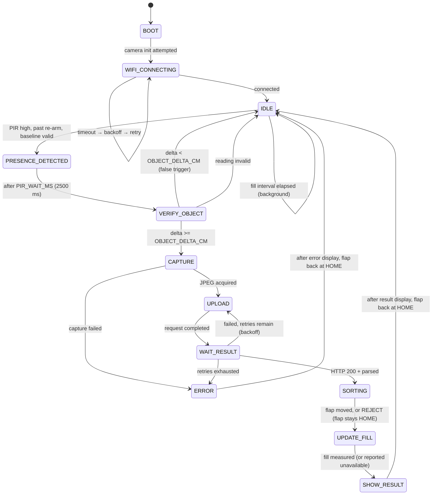

# State machine

Implemented in [`iot/firmware/src/core/state_machine.cpp`](../firmware/src/core/state_machine.cpp).
Pure logic: it talks only to the interfaces in `core/hal.h` and receives time as a
parameter, which is why all nine specification scenarios run as desktop unit tests.

## States

`SORTING` and `UPDATE_FILL` were added in IoT Checkpoint 1. `SORTING` asks
`resolveSorting()` whether the item may be sorted at all and moves the flap only
if the answer is yes; `UPDATE_FILL` re-reads the HC-SR04 *after* the item has
landed, so the fill percentage on the completion screen belongs to this
transaction. If that reading fails, no percentage is shown — the previous value
is not reused as though it were fresh. Both are documented in
[iot-checkpoint-1.md](iot-checkpoint-1.md).

## Why the flow looks like this

**PIR alone never triggers a capture.** The specification is explicit (§26): PIR
plus secondary evidence must qualify the event. `PRESENCE_DETECTED` exists purely
to wait out `PIR_WAIT_MS` so the ultrasonic sensor measures *after* someone has
had time to let go of something, and `VERIFY_OBJECT` is the gate that decides.
A person walking past produces no image and no model call at all.

**Distance must DROP to confirm.** The sensor looks down from the bin lid, so
waste landing in the bin makes the surface closer. `delta = baseline - after`,
and only a positive delta above threshold counts. A person leaning over the bin
and stepping back leaves the distance unchanged.

**Every exit from CAPTURE/UPLOAD/WAIT_RESULT releases the framebuffer.** They all
route through `releaseFrameIfHeld()`. A leaked buffer starves the next capture,
and the failure looks like a broken camera three events later.

**ERROR always leaves.** After `errorDisplayMs` it returns to IDLE. There is no
state the device can be stuck in, and it never reboots to recover (§15).

**Bin fullness is a background state, not a state in this diagram.** It is tracked
by `BinFullTracker` and surfaces as the LED *background*, so a full bin never
interrupts or blocks a classification (§16).

## Timing and thresholds

Every value is injected via `StateMachineConfig`, sourced from `config.h`. None is
hard-coded in logic — which is what lets the unit tests run a 2.5 s wait in
simulated milliseconds.

| Constant | Default | Meaning |
|---|---|---|
| `PIR_WAIT_MS` | 2500 ms | Settle time before the confirming measurement |
| `OBJECT_DELTA_CM` | 4.0 cm | Minimum drop in distance to confirm a deposit |
| `PIR_REARM_MS` | 5000 ms | Cool-down after any event before PIR is honoured again |
| `FILL_INTERVAL_MS` | 300000 ms | Background fill measurement period |
| `MAX_RETRY` | 3 | Hard bound on upload attempts |
| `RETRY_DELAY_MS` | 2000 ms | Base backoff, doubling to `RETRY_MAX_DELAY_MS` |
| `HTTP_TIMEOUT_MS` | 10000 ms | Connect and read timeout |

## Failure behaviour

| Failure | Response |
|---|---|
| Wi-Fi unavailable | Stays in `WIFI_CONNECTING`, non-blocking, retries with backoff. Never freezes |
| Camera init fails | Logged, `lastError = Camera`, device continues — fill monitoring still works. No reboot loop |
| Capture fails | Buffer released, `ERROR`, orange LED, back to `IDLE` |
| Upload times out | Up to `MAX_RETRY` attempts with exponential backoff, then gives up and returns to `IDLE` |
| Invalid JSON in response | Treated as a failed delivery, same bounded retry |
| Ultrasonic timeout | Reading reported invalid; **no fill value is produced**; event not confirmed |
| Backend returns `refused`/`error` | Result shown as inconclusive; the device does not assert a label |
