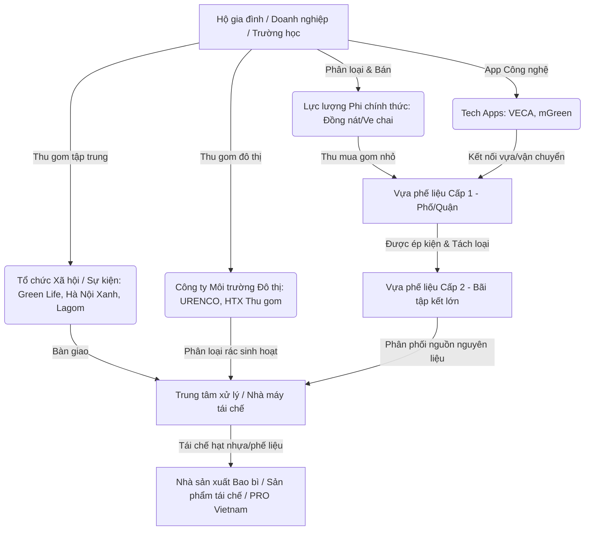

# BÁO CÁO NGHIÊN CỨU HỆ SINH THÁI THU GOM & TÁI CHẾ RÁC THẢI TẠI VIỆT NAM

---

## I. TỔNG QUAN HỆ SINH THÁI STAKEHOLDERS (CÁC BÊN LIÊN QUAN)

Hệ sinh thái thu gom và tái chế rác thải tại Việt Nam hiện đang chuyển dịch từ **mô hình truyền thống phi chính thức (Informal Sector)** sang **mô hình chính thức hóa (Formalization)** dưới tác động của chính sách **EPR (Trách nhiệm mở rộng của nhà sản xuất)** theo Luật Bảo vệ Môi trường 2020.

### 1. Phân loại chi tiết các nhóm Stakeholders

| Nhóm Stakeholder | Thành phần chính | Đặc điểm vận hành | Vai trò trong chuỗi |
| :--- | :--- | :--- | :--- |
| **1. Lực lượng Phi chính thức (Informal)** | Người nhặt rác, ve chai, đồng nát (đi xe đạp/xe máy), người phân loại tại bãi rác. | Vận hành tự do, không có hợp đồng lao động, thu nhập phụ thuộc vào biến động giá phế liệu hàng ngày. | Thu gom khoảng 60-80% lượng rác tái chế hộ gia đình. |
| **2. Vựa phế liệu Truyền thống (Scrap Yards)** | - Vựa Cấp 1 (Trung gian nhỏ ở các ngõ/phường). - Vựa Cấp 2 (Bãi ép kiện lớn ở vùng ven). | Giao dịch chủ yếu bằng tiền mặt, ghi chép tay, phân loại thủ công, sơ chế cơ bản (nén, đè, đóng kiện). | Trạm trung chuyển và tích trữ phế liệu quy mô vừa & lớn. |
| **3. Tổ chức Xã hội / Phi lợi nhuận (NGOs/CSOs/Community)** | - **Xanh Hà Nội / Hà Nội Xanh**: Đội tình nguyện dọn rác kênh rạch. - **Green Life**: Dự án "Đổi rác lấy cây/quà". - **Keep Hanoi Clean**. | Hoạt động dựa trên cộng đồng, truyền thông nâng cao nhận thức, thu gom rác điện tử, vỏ hộp sữa, nhựa màng mỏng. | Giáo dục cộng đồng & Thu gom rác thải giá trị thấp. |
| **4. Doanh nghiệp Thu gom Đô thị & HTX** | - **URENCO Hà Nội** (Môi trường đô thị). - **HTX Thành Công**, Công ty Môi trường quận/huyện. | Thu gom rác thải sinh hoạt theo địa bàn hành chính, quản lý các điểm cẩu rác/trạm trung chuyển. | Đảm bảo hạ tầng vệ sinh công cộng & Phân loại tại trạm. |
| **5. Nền tảng Công nghệ (Recycling Tech Startups)** | - **VECA (Vựa Số)**: App đặt lịch gom rác & quản lý vựa. - **Lagom Việt Nam**: Giải pháp thu gom vỏ hộp sữa & màng nhựa. - **mGreen, Resette**. | Số hóa quy trình thu gom, minh bạch giá cả, truy xuất nguồn gốc rác thải, cung cấp báo cáo ESG/CSR. | Kết nối các bên & Chính thức hóa chuỗi thu gom. |
| **6. Nhà máy Tái chế (Recyclers / Remanufacturers)** | - **Duy Tân Recycling** (Tái chế nhựa PET/HDPE chuẩn High-grade). - **Việt Tiến, Nam Hà Anh**. - **Làng nghề tái chế** (Chỉ Đạo - Hưng Yên, Minh Khai - Hưng Yên, Triều曲 - Hà Nội). | Tái chế công nghiệp (nghiền, rửa, tạo hạt rPET, nấu nhôm/sắt/giấy). | Chuyển hóa phế liệu thành nguyên liệu sản xuất mới. |
| **7. Liên minh Doanh nghiệp & EPR (PRO Vietnam)** | **PRO Vietnam** (Coca-Cola, PepsiCo, Nestlé, Unilever, TH Group...), Bộ TN&MT (Quỹ Bảo vệ Môi trường). | Tài trợ tài chính cho hệ thống thu gom, ủy quyền thu gom tái chế để đáp ứng tỷ lệ tái chế bắt buộc theo Luật. | Định hình chính sách & Tài trợ vốn cho chuỗi giá trị. |

---

## II. QUY TRÌNH NGHIỆP VỤ & CÁCH THỨC THU GOM, XỬ LÝ

### 1. Quy trình Thu gom & Sơ chế Truyền thống (Informal Chain)
1. **Thu mua đầu nguồn**: Ve chai/đồng nát di chuyển theo tuyến phố/hộ gia đình, mua phế liệu (giấy carton, chai nhựa, lon nhôm, sắt vụn).
2. **Gom về Vựa Cấp 1**: Ve chai bán lại cho vựa cấp 1 gần nhất để ăn chênh lệch giá (khoảng 10-20%).
3. **Phân loại & Phân tách chi tiết**:
   - Nhựa: Phân theo chất liệu (PET: chai nước lọc; HDPE: chai can; PP: chậu nhựa/hộp thực phẩm; PVC, PS).
   - Kim loại: Tách đồng, nhôm, sắt, inox.
   - Giấy: Bìa carton, giấy trắng, báo cũ.
4. **Gom về Vựa Cấp 2 (Bãi ép kiện)**: Vựa cấp 1 dùng xe tải chở phế liệu đã phân loại đến vựa cấp 2. Tại đây có máy ép thủy lực để ép nén bìa carton, chai nhựa thành các kiện hàng lớn (300kg - 1 tấn/kiện).
5. **Vận chuyển tới Nhà máy/Làng nghề**: Phế liệu dạng kiện được xe container chở tới các làng nghề hoặc nhà máy tái chế.

### 2. Quy trình Thu gom Chuyên nghiệp / Mô hình Công nghệ (Formal/Tech Chain)
1. **Đặt lịch qua App / Kế hoạch thu gom cố định**: Hộ gia đình/văn phòng đặt lịch qua app (VECA) hoặc Lagom thu gom theo lịch định kỳ tại trường học/văn phòng.
2. **Ghi nhận Dữ liệu số**: Cân trọng lượng tại chỗ, nhập khối lượng vào app, tự động tính tiền/tích điểm thưởng.
3. **Nguồn thu gom chuyên biệt**: Thu gom cả rác giá trị thấp (vỏ hộp sữa Tetra Pak, túi nilon, màng bọc PE) mà đồng nát truyền thống thường từ chối thu gom.
4. **Đưa về Trung tâm Phân loại Tập trung**: Rác được rửa, ép và sơ chế đạt tiêu chuẩn công nghiệp (độ ẩm < 5%, không lẫn chất bẩn hữu cơ).

### 3. Quy trình Xử lý & Tái chế Kỹ thuật (Processing & Recycling)
- **Plastic Recycling (Nhựa)**: Băm nhỏ (Shredding) $\rightarrow$ Giặt rửa hóa chất sạch (Washing) $\rightarrow$ Sấy khô $\rightarrow$ Nấu chảy nén đùn (Extrusion) $\rightarrow$ Cắt hạt nhựa tái sinh (rPET, rHDPE, rPP).
- **Paper Recycling (Giấy)**: Ngâm ủ tạo bột giấy (Pulping) $\rightarrow$ Sàng lọc loại bỏ keo/băng dính $\rightarrow$ Tẩy mực (De-inking) $\rightarrow$ Cán màng giấy bìa carton mới.
- **Aluminum / Metal (Kim loại)**: Nung chảy nhiệt độ cao $\rightarrow$ Loại bỏ xỉ $\rightarrow$ Đúc thỏi nhôm/thép nguyên liệu.

---

## III. NHỮNG PAIN POINTS MỚI & THÁCH THỨC CỐT LÕI (2024 - 2026)

> [!IMPORTANT]
> **Điểm đau lớn nhất hiện nay**: Sự xung đột giữa **Quy định EPR bắt buộc (cần hóa đơn GTGT & minh bạch nguồn gốc)** và **Bản chất phi chính thức (tiền mặt, không hóa đơn) của 80% lực lượng thu gom đầu nguồn**.

### 1. Pain Point #1: Thách thức Chứng từ & Hóa đơn GTGT khi thực thi EPR (Decree 08/2022/NĐ-CP)
- **Thực trạng**: Khi doanh nghiệp sản xuất (PRO Vietnam) tài trợ hoặc ký hợp đồng thu gom với nhà máy tái chế để đạt chỉ tiêu EPR, nhà nước yêu cầu phải có **Hóa đơn GTGT và Báo cáo truy xuất nguồn gốc**.
- **Nút thắt**: Lực lượng ve chai và chủ vựa phế liệu nhỏ không thể xuất hóa đơn đầu vào. Việc này khiến nhà máy tái chế không chứng minh được chi phí hợp lệ và sản lượng tái chế chính thức.

### 2. Pain Point #2: Phân loại rác tại nguồn còn yếu & Rác giá trị thấp bị bỏ rơi
- Theo Luật BVMT 2020, từ 31/12/2024 việc phân loại rác tại nguồn là bắt buộc, tuy nhiên hạ tầng thu gom chưa đồng bộ.
- Nhựa màng mỏng (túi nilon, màng PE), vỏ hộp sữa, xốp EPS có chi phí thu gom & vận chuyển cao hơn giá trị phế liệu bán ra, dẫn đến việc đồng nát bỏ qua, gây ô nhiễm môi trường.

### 3. Pain Point #3: Chi phí Logistics cồng kềnh & Biến động giá phế liệu
- Phế liệu nhựa/bìa có thể tích lớn nhưng khối lượng nhẹ $\rightarrow$ Chi phí vận chuyển/km rất cao nếu chưa được ép kiện tại chỗ.
- Biến động giá nhựa nguyên sinh trên thế giới (khi giá dầu giảm) khiến giá nhựa tái chế mất thế cạnh tranh, gây thua lỗ cho các vựa phế liệu và nhà máy tái chế.

### 4. Pain Point #4: Rủi ro Mặt bằng & Môi trường/PCCC tại các Vựa phế liệu
- Hầu hết các vựa phế liệu tại Hà Nội và TP.HCM nằm trong khu dân cư đông đúc, vi phạm quy định PCCC, nguy cơ cháy nổ cao.
- Chính quyền địa phương đang thắt chặt quản lý và truy quét các vựa phế liệu không đủ điều kiện môi trường/PCCC, khiến nhiều vựa bị giải tỏa nhưng chưa có quy hoạch cụ chế cụm công nghiệp phế liệu thay thế.

### 5. Pain Point #5: An sinh xã hội & Đời sống của lực lượng Đồng nát
- Lực lượng lao động yếu thế chịu rủi ro độc hại cao, không có bảo hiểm y tế/bảo hiểm xã hội, thu nhập không ổn định và thiếu thiết bị bảo hộ lao động.

---

## IV. NGUỒN THU GOM & KÊNH TIẾP CẬN

1. **Kênh Thu gom Truyền thống (B2C & C2B)**:
   - Thu gom lưu động tại từng hộ gia đình (đồng nát ngõ ngách).
   - Thu mua trực tiếp tại các Vựa phế liệu cố định.

2. **Kênh Tổ chức / Doanh nghiệp (B2B)**:
   - Phế liệu công nghiệp từ các Nhà máy, Khu công nghiệp (bìa carton, pallet nhựa, sắt vụn gia công).
   - Phế liệu thương mại từ Siêu thị (WinMart, Go!, Lotte), Tòa nhà văn phòng, Trường học.

3. **Kênh Cộng đồng & Xã hội (Social Organizations)**:
   - Các chương trình "Đổi rác lấy cây/quà" của **Green Life**, **Hội Phụ nữ** (Ngôi nhà xanh).
   - Hoạt động dọn rác và phân loại của **Hà Nội Xanh / Xanh Hà Nội**, **Keep Hanoi Clean**.

4. **Kênh Nền tảng Số (Digital Platforms)**:
   - Đặt lịch qua ứng dụng mobile **VECA**, **mGreen** hoặc hệ thống thu gom của **Lagom**.

---

## VI. DANH SÁCH THÔNG TIN LIÊN HỆ ĐƠN VỊ THU GOM & TÁI CHẾ TIÊU BIỂU

| STT | Tên Đơn vị / Tổ chức | Loại hình | Khu vực chính | Số điện thoại / Hotline | Website / Kênh liên hệ |
| :--- | :--- | :--- | :--- | :--- | :--- |
| 1 | **Lagom Việt Nam** | Doanh nghiệp tái chế/Xã hội | Hà Nội & TP.HCM | **0977 107 871** | [lagom.vn](https://lagom.vn) |
| 2 | **VECA (Ứng dụng Vựa Số)** | Tech Startup Thu gom | TP.HCM & Toàn quốc | **0906 863 836** / App Store | [veca-app.com](https://veca-app.com) |
| 3 | **URENCO Hà Nội** | Doanh nghiệp Môi trường Đô thị | Hà Nội | **(024) 3823 2565** | [urenco.com.vn](https://urenco.com.vn) |
| 4 | **Dự án Green Life** | Tổ chức Xã hội (Đổi rác lấy quà) | Hà Nội | **0376 683 988** | Fanpage: `Green Life` (Facebook) |
| 5 | **Câu lạc bộ Hà Nội Xanh** | Nhóm Tình nguyện Cộng đồng | Hà Nội | Qua Fanpage Facebook | Fanpage: `Hà Nội Xanh` |
| 6 | **PRO Vietnam** | Liên minh Tái chế Bao bì | TP.HCM & Hà Nội | **(028) 3535 5998** | [provietnam.com.vn](https://provietnam.com.vn) |
| 7 | **Duy Tân Recycling** | Nhà máy Tái chế Nhựa PET/HDPE | Long An / TP.HCM / HN | **(028) 3754 5555** | [duytanrecycling.com](https://duytanrecycling.com) |
| 8 | **HTX Môi trường Thành Công** | HTX Thu gom rác thải | Hà Nội (Thanh Xuân/Cầu Giấy) | **(024) 3557 1289** | Văn phòng HTX Thành Công |

---

## VIII. BẢNG TỔNG HỢP CHI TIẾT CÁC ĐƠN VỊ THU GOM & TÁI CHẾ TẠI ĐỊA PHẬN HÀ NỘI

### Bảng 1: Các Tổ chức Xã hội, Phi lợi nhuận & Cộng đồng tại Hà Nội

| STT | Tên Tổ chức / Dự án | Lĩnh vực thu gom chính | Địa bàn hoạt động | Hotline / Zalo | Kênh liên hệ / Fanpage |
| :--- | :--- | :--- | :--- | :--- | :--- |
| 1 | **Dự án Green Life** | Giấy, bìa, chai nhựa, pin cũ, thiết bị điện tử ("Đổi rác lấy cây") | Các quận nội thành Hà Nội | **0376 683 988** | Fanpage: `Green Life` (Facebook) |
| 2 | **Câu lạc bộ Hà Nội Xanh** | Dọn rác kênh rạch, thu gom rác phân loại | Khắp các quận/huyện Hà Nội | Inbox Fanpage | Fanpage: `Hà Nội Xanh` (Facebook) |
| 3 | **Keep Vietnam Clean** (Keep Hanoi Clean) | Truyền thông nâng cao nhận thức, dọn rác & phân loại | Ba Đình, Tây Hồ, Cầu Giấy | Qua Website | [keepvietnamclean.org](https://keepvietnamclean.org) |
| 4 | **Lagom Việt Nam (Chi nhánh HN)** | Vỏ hộp sữa Tetra Pak, màng nhựa PE | Trường học, văn phòng tại Hà Nội | **0977 107 871** | [lagom.vn](https://lagom.vn) |

### Bảng 2: Công ty Môi trường Đô thị & HTX Thu gom tại Hà Nội

| STT | Tên Đơn vị | Khu vực phụ trách tại HN | Địa chỉ văn phòng / Trạm | Hotline / Điện thoại |
| :--- | :--- | :--- | :--- | :--- |
| 1 | **URENCO Hà Nội (Trụ sở)** | Điều hành chung môi trường đô thị | 282 Kim Mã, Ba Đình, Hà Nội | **(024) 3823 2565** |
| 2 | **URENCO 1 (Chi nhánh Ba Đình)** | Quận Ba Đình | 282 Kim Mã, Ngõ Ngọc Hà | **0961 522 233** |
| 3 | **URENCO 2 (Chi nhánh Hoàn Kiếm)** | Quận Hoàn Kiếm | 48 Tràng Thi, Hoàn Kiếm | **0961 112 324** |
| 4 | **URENCO 3 (Chi nhánh Hai Bà Trưng)** | Quận Hai Bà Trưng | 10 Ngõ Mai Hương, Bạch Mai | **0961 112 324** |
| 5 | **URENCO 4 (Chi nhánh Đống Đa)** | Quận Đống Đa | 56 Ngõ 212 Đê La Thành | **(024) 3513 1406** |
| 6 | **HTX Môi trường Thành Công** | Quận Thanh Xuân, Hoài Đức, Đan Phượng | Phường Nhân Chính, Thanh Xuân | **(024) 3557 1289** |
| 7 | **Công ty Giải pháp Môi trường Green Life** | Huyện Thanh Trì và khu vực lân cận | Ngõ 171 Phan Trọng Tuệ, Thanh Trì | **0376 683 988** |

### Bảng 3: Các Vựa Phế liệu & Công ty Thu mua Phế liệu Lớn theo Quận/Huyện tại Hà Nội

| STT | Tên Công ty / Vựa phế liệu | Mặt hàng thu gom chủ lực | Địa chỉ Kho / Bãi | Hotline liên hệ |
| :--- | :--- | :--- | :--- | :--- |
| 1 | **DONGNAT VN (dongnat.vn)** | Sắt thép, inox, đồng, nhôm, giấy, nhựa, linh kiện | Cầu Tó, Huyện Thanh Trì, Hà Nội | **0912 569 595** |
| 2 | **Phế liệu Bảo Phong** | Đồng, nhôm, inox, nhựa, bìa carton, công trình | Số 20 Bùi Huy Bích, Hoàng Mai, Hà Nội | **0988 186 878** |
| 3 | **Phế liệu Việt Đức** | Phế liệu công nghiệp, nhà xưởng, giấy, nhựa, kim loại | Số 56 Bùi Huy Bích, Hoàng Liệt, Hoàng Mai | **097 1519 789** |
| 4 | **Phế liệu Khang Phát** | Sắt thép công trình, xe cơ giới cũ, nhựa, giấy | Số 24 Bùi Huy Bích, Hoàng Mai, Hà Nội | **0971 778 799** |
| 5 | **Chợ Đồ cũ Tuấn Tú** | Phế liệu văn phòng, đồ nhựa, kim loại, máy móc cũ | Khu vực Quận Cầu Giấy, Hà Nội | **0983 967 373** |
| 6 | **Phế liệu Hòa Phát** | Thu mua tận nơi phế liệu hộ gia đình, vựa nhỏ | Phủ sóng Cầu Giấy, Nam Từ Liêm, Hà Đông | **0985 050 716** |

### Bảng 4: Cụm Làng nghề Tái chế & Trạm Trung chuyển Phế liệu vùng ven Hà Nội

| STT | Tên Cụm / Làng nghề | Loại phế liệu xử lý chính | Địa chỉ cụ thể | Ghi chú vận hành |
| :--- | :--- | :--- | :--- | :--- |
| 1 | **Làng nghề Tái chế Nhựa Triều Khúc** | Phân loại nhựa, băm hạt nhựa, bao bì nhựa | Thôn Triều Khúc, Xã Tân Triều, Thanh Trì, HN | Lối vào từ Ngõ 300 Nguyễn Xiển, có hàng trăm xưởng gia đình |
| 2 | **Làng nghề Tái chế Nhựa Minh Khai** | Nhựa phế liệu, túi nilon, màng PE, băm rửa hạt | TT. Như Quỳnh, Văn Lâm, Hưng Yên (giáp Gia Lâm, HN) | Trạm trung chuyển & tái chế nhựa lớn nhất miền Bắc |
| 3 | **Làng nghề Tái chế Kim loại Đa Hội** | Sắt vụn, đồng, nhôm, đúc phôi kim loại | Phường Châu Khê, TP. Từ Sơn (giáp Long Biên, HN) | Xử lý kim loại phế liệu quy mô lớn cho Hà Nội |

---

## IX. BẢNG GIÁ THU MUA CÁC VẬT LIỆU TÁI CHẾ TẠI VIỆT NAM (CẬP NHẬT 2026)

### 1. Phế liệu Kim loại (Kim loại màu & Kim loại đen)

| Nhóm kim loại | Phân loại chi tiết | Giá thu mua tham khảo (VNĐ/kg) | Ghi chú chất lượng |
| :--- | :--- | :--- | :--- |
| **Đồng** | Đồng cáp (loại 1) | 260.000 – 430.000 | Ruột dây điện lớn, không cháy, sạch keo |
| | Đồng đỏ (loại 2) | 240.000 – 380.000 | Dây điện dẻo, ống đồng điều hòa |
| | Đồng vàng (thau) | 150.000 – 320.000 | Vòi nước, chi tiết máy, thau đồng |
| | Đồng cháy / mô tơ | 90.000 – 300.000 | Dây quấn động cơ chập cháy |
| **Nhôm** | Nhôm đà / Nhôm thanh | 50.000 – 95.000 | Nhôm khung cửa Xinhfa, nhôm định hình |
| | Vỏ lon nhôm (lon bia/nước ngọt) | 30.000 – 45.000 | Đã đạp bẹp hoặc giữ nguyên |
| | Nhôm máy / Nhôm đúc | 40.000 – 98.000 | Bloc máy, chi tiết xe máy |
| | Mạt nhôm / Ba dớ nhôm | 15.000 – 79.000 | Vụn nhôm tiện phay |
| **Inox** | Inox 304 | 25.000 – 90.000 | Inox không hít từ tính, dùng cho thực phẩm |
| | Inox 201 | 10.000 – 40.000 | Inox gia dụng thông thường |
| **Sắt / Thép** | Sắt đặc / Sắt công trình | 12.000 – 18.000 | Thép phi, thép U I V, sắt cây |
| | Sắt vụn / Dầm nhà / Sắt gỉ | 8.000 – 14.000 | Sắt phế thải dân dụng |

### 2. Phế liệu Nhựa (Chất dẻo)

| Loại nhựa | Phân loại chi tiết | Giá thu mua tham khảo (VNĐ/kg) | Ứng dụng tái chế |
| :--- | :--- | :--- | :--- |
| **Nhựa PET** | Chai nước khoáng, chai nước ngọt trong suốt | 12.000 – 27.000 | Tái chế thành hạt rPET, xơ sợi tổng hợp |
| **Nhựa HDPE** | Can chai dầu xả, dầu gội, ống nhựa chai lọ đục | 17.000 – 35.000 | Tái chế thành chai lọ HDPE mới, ống nhựa |
| **Nhựa PP** | Chậu nhựa, hộp đựng thực phẩm, pallet nhựa | 14.000 – 52.000 | Tái chế hạt nhựa PP bao bì, đồ gia dụng |
| **Màng nhựa PE / Nilon**| Túi nilon sạch, màng bọc PE quấn hàng | 10.000 – 22.000 | Ép củi nhựa, tái chế túi nilon tái sinh |
| **Nhựa ABS / PVC** | Bàn ghế nhựa cứng, vỏ máy tính, ống nước PVC | 6.000 – 75.000 | Vỏ linh kiện, đồ nhựa kĩ thuật |

### 3. Phế liệu Giấy & Bao bì

| Loại giấy | Phân loại chi tiết | Giá thu mua tham khảo (VNĐ/kg) |
| :--- | :--- | :--- |
| **Giấy Carton** | Bìa thùng carton khô, sạch | 3.000 – 9.300 |
| **Giấy Báo / Giấy Sách**| Giấy văn phòng trắng, sách báo cũ | 4.500 – 17.800 |
| **Vỏ hộp sữa (Tetra Pak)**| Bao bì đa lớp (giấy + nhựa + nhôm) | 1.000 – 3.000 *(thường gom qua Lagom/Green Life)* |

### 4. Rác thải Điện tử & Phế liệu Đặc biệt (E-Waste)

| Loại phế liệu | Chi tiết thu gom | Mức giá tham khảo |
| :--- | :--- | :--- |
| **Chai thủy tinh** | Chai bia, chai rượu, hũ thủy tinh | 500 – 3.000 VNĐ/cái (hoặc 1.000 - 3.000 VNĐ/kg) |
| **Pin Lithium / Pin laptop** | Pin Li-ion, Pin Lithium xe điện, năng lượng mặt trời | 45.000 – 250.000 VNĐ/kg |
| **Bo mạch điện tử cũ** | Mainboard máy tính, bo tivi, tủ lạnh, điện thoại | 30.000 – 350.000 VNĐ/kg (tùy hàm lượng chip/đồng/vàng) |

---

## X. DANH SÁCH ĐỊA CHỈ TRÊN GOOGLE MAPS CỦA CÁC ĐƠN VỊ THU GOM TÁI CHẾ TẠI HÀ NỘI

Dưới đây là danh sách địa chỉ chuẩn xác được xác thực trên Google Maps, kèm theo **Từ khóa gõ tìm đường (Maps Search Query)** giúp người dùng tra cứu vị trí nhanh chóng trên ứng dụng Google Maps.

### 1. Hệ thống Thu gom Công ích Đô thị (URENCO & HTX)

| Tên Đơn vị | Địa chỉ chính xác | Phường / Quận / Huyện | Từ khóa gõ trên Google Maps | Hotline / ĐT |
| :--- | :--- | :--- | :--- | :--- |
| **URENCO Hà Nội (Trụ sở chính)** | 282 Phố Kim Mã | Phường Ngọc Hà, Quận Ba Đình | `Công ty Môi trường Đô thị Hà Nội 282 Kim Mã` | (024) 3823 2565 |
| **URENCO 1 (Chi nhánh Ba Đình)** | 282 Phố Kim Mã | Phường Ngọc Hà, Quận Ba Đình | `Urenco Ba Đình 282 Kim Mã` | 0961 522 233 |
| **URENCO 2 (Chi nhánh Hoàn Kiếm)**| 48 Phố Tràng Thi | Phường Hàng Bông, Quận Hoàn Kiếm | `Chi nhánh Urenco Hoàn Kiếm 48 Tràng Thi` | 0961 112 324 |
| **URENCO 3 (Chi nhánh Hai Bà Trưng)**| Số 10 Ngõ Mai Hương, Bạch Mai | Phường Bạch Mai, Quận Hai Bà Trưng | `Urenco Hai Bà Trưng ngõ Mai Hương` | 0961 112 324 |
| **URENCO 4 (Chi nhánh Đống Đa)** | Số 56 Ngõ 212 Đê La Thành | Phường Thổ Quan, Quận Đống Đa | `Urenco Đống Đa 212 Đê La Thành` | (024) 3513 1406 |
| **HTX Môi trường Thành Công** | Số 145 Đường Hồ Mễ Trì | Phường Nhân Chính, Quận Thanh Xuân | `HTX Thành Công Hồ Mễ Trì` | (024) 3557 1289 |

### 2. Các Công ty & Bãi Thu mua Phế liệu Lớn

| Tên Công ty / Vựa phế liệu | Địa chỉ chính xác | Phường / Quận / Huyện | Từ khóa gõ trên Google Maps | Hotline |
| :--- | :--- | :--- | :--- | :--- |
| **Phế liệu Bảo Phong** | Số 20 Đường Bùi Huy Bích | Phường Hoàng Liệt, Quận Hoàng Mai | `Phế liệu Bảo Phong Bùi Huy Bích` | 0988 186 878 |
| **Phế liệu Việt Đức** | Số 56 Đường Bùi Huy Bích | Phường Hoàng Liệt, Quận Hoàng Mai | `Công ty phế liệu Việt Đức Bùi Huy Bích` | 097 1519 789 |
| **Phế liệu Khang Phát** | Số 24 Đường Bùi Huy Bích | Phường Hoàng Liệt, Quận Hoàng Mai | `Phế liệu Khang Phát 24 Bùi Huy Bích` | 0971 778 799 |
| **DONGNAT VN (Đồng Nát VN)** | Trụ sở: 115 Ngõ 107 Nguyễn Chí Thanh Kho bãi: Khu vực Cầu Tó | Láng Hạ, Đống Đa / Tả Thanh Oai, Thanh Trì | `Dongnat.vn Nguyễn Chí Thanh` hoặc `Kho phế liệu Cầu Tó` | 0912 569 595 |
| **Chợ Đồ cũ Tuấn Tú** | Số 8 Đường Phạm Hùng | Phường Mai Dịch, Quận Cầu Giấy | `Chợ đồ cũ Tuấn Tú Phạm Hùng` | 0983 967 373 |
| **Giải pháp Môi trường Green Life** | VPGD: 16B Ngõ 74 Đường Tứ Hiệp (hoặc Ngõ 171 Phan Trọng Tuệ) | Xã Tứ Hiệp / Thị trấn Văn Điển, Thanh Trì | `Công ty TNHH Giải pháp Môi trường Green Life Thanh Trì` | 0376 683 988 |

### 3. Cụm Làng nghề Tái chế & Trạm Đầu mối Vùng ven Hà Nội

| Tên Cụm / Làng nghề | Địa chỉ chính xác | Xã / Huyện / Tỉnh giáp ranh | Từ khóa gõ trên Google Maps | Đặc điểm tìm đường |
| :--- | :--- | :--- | :--- | :--- |
| **Làng nghề Tái chế Nhựa Triều Khúc** | Cụm làng nghề tập trung Triều Khúc (Lối vào Ngõ 300 Nguyễn Xiển) | Xã Tân Triều, Huyện Thanh Trì, Hà Nội | `Cụm công nghiệp làng nghề Triều Khúc` | Nằm ngay ngã tư Nguyễn Xiển - Tân Triều |
| **Làng nghề Tái chế Nhựa Minh Khai** | Thị trấn Như Quỳnh | Huyện Văn Lâm, Tỉnh Hưng Yên (Giáp Quận Long Biên & Gia Lâm) | `Làng nghề tái chế nhựa Minh Khai Như Quỳnh` | Đi theo Quốc lộ 5A hướng Hà Nội - Hưng Yên |
| **Làng nghề Tái chế Kim loại Đa Hội** | Phường Châu Khê | Thành phố Từ Sơn, Tỉnh Bắc Ninh (Giáp Huyện Đông Anh & Long Biên) | `Làng nghề sắt thép Đa Hội Châu Khê` | Đi qua cầu Đuống / Quốc lộ 3 hướng Bắc Ninh |

---

## XI. PHÂN TÍCH CASE STUDY THỰC TẾ: PAIN POINTS TỪ GIAO DỊCH PHẾ LIỆU TRÊN MẠNG XÃ HỘI

Dựa trên 3 hình ảnh giao dịch thực tế từ các hội nhóm Facebook (`Hội Máy In Offset`, `Hội Thu Mua Nhựa Phế Liệu Miền Bắc`, `Hội Phế Liệu Nhập`):

### 1. Pain Point #1: Kênh bán tự phát, thiếu nền tảng Sàn giao dịch B2B chuẩn hóa
- **Thực trạng**: Các chủ nguồn thải (nhà in offset, cơ sở đại lý chai nước 19L, vựa gom PE) phải tự chụp ảnh đăng bài thủ công lên các nhóm Facebook cá nhân.
- **Hệ quả**: Bài đăng dễ bị trôi, tốn thời gian "inbox/alo" thương lượng từng đơn. Tỷ lệ khớp lệnh giữa người bán (nguồn thải) và người mua (nhà máy tái chế thực sự) rất thấp và mang tính may rủi.

### 2. Pain Point #2: Thông tin giá cả mập mờ & Rủi ro tín nhiệm (Trust & Price Opacity)
- **Thực trạng**: 100% bài đăng đều ghi "giá thỏa thuận", "alo 087...", "giá tốt nhất".
- **Hệ quả**: Người bán không biết đâu là giá thị trường chuẩn, dễ bị thương lái ép giá. Giao dịch qua nick Facebook cá nhân tiềm ẩn rủi ro lừa đảo cọc, bùng tiền hoặc giao phế liệu không đúng phẩm cấp.

### 3. Pain Point #3: Chi phí lưu kho & Sự cồng kềnh của phế liệu chưa qua xử lý (Bulkiness Issue)
- **Thực trạng**: Hàng trăm chai nhựa 19L rỗng chất đống chiếm trọn căn phòng sinh hoạt/kho hẹp (Ảnh 2); bản kẽm in offset chất đống ở góc xưởng (Ảnh 1).
- **Hệ quả**: Tốn diện tích mặt bằng kinh doanh/sinh hoạt. Việc vận chuyển phế liệu rỗng cồng kềnh (chưa băm/chưa ép kiện) làm chi phí Logistics/kg tăng cao, ngốn sạch lợi nhuận của người bán.

### 4. Pain Point #4: Chất lượng nguyên liệu không đồng đều & Rào cản Hóa đơn EPR
- **Thực trạng**: Màng PE bọc kiện (Ảnh 3) bị nhiễm bẩn đất đá/bụi; chai 19L lẫn nhiều nhãn mác khác nhau; nhôm bản kẽm còn dính hóa chất mực in.
- **Hệ quả**: Nhà máy tái chế phải tốn chi phí súc rửa, phân loại lại. Đặc biệt, các giao dịch thỏa thuận qua Facebook này **hoàn toàn không có Hóa đơn GTGT**, khiến nhà máy tái chế không thể nghiệm thu chi phí EPR với cơ quan quản lý.

---

## XII. NGHIÊN CỨU NỀN TẢNG & SẢN PHẨM CÔNG NGHỆ TÁI CHẾ HIỆN CÓ TẠI VIỆT NAM

### 1. Ma trận Phân tích Sản phẩm Đối thủ / Liên quan tại Việt Nam

| Tên Sản phẩm / Platform | Mô hình Hoạt động | Khách hàng Mục tiêu | Tính năng Nổi bật | Điểm mạnh (Strengths) | Điểm yếu / Lỗ hổng (Gaps) |
| :--- | :--- | :--- | :--- | :--- | :--- |
| **VECA (Vựa Số)** | App Mobile B2C/B2B (Ve chai công nghệ) | Hộ gia đình, Người thu gom, Chủ vựa phế liệu | Đặt lịch bán ve chai tận nhà, niêm yết giá công khai, phần mềm sổ sách "VECA Vựa Số" cho chủ vựa. | UX/UI thân thiện, đã số hóa được vựa truyền thống, truyền thông tốt. | Chủ yếu xử lý đơn lẻ B2C; Chưa có sàn đấu giá B2B cho khối lượng hàng chục tấn; Chưa xử lý khâu Hóa đơn GTGT EPR. |
| **GRAC** | Nền tảng SaaS B2G / B2B / B2C | Chính quyền địa phương, Đơn vị thu gom đô thị, Doanh nghiệp EPR | Thanh toán tiền rác online, tra cứu tiền rác sinh hoạt, báo cáo dữ liệu truy xuất tái chế EPR. | Tích hợp sâu vào hạ tầng dịch vụ công ích đô thị & quản lý rác sinh hoạt. | Tập trung mảng quản lý rác thải sinh hoạt (B2G), chưa tối ưu thương mại phế liệu công nghiệp B2B. |
| **mGreen** | App B2C / Gamification tích điểm | Cư dân chung cư, Trường học, Nhãn hàng CSR | Phân loại rác đặt lịch thu gom tích điểm mPoint, đổi E-voucher mua sắm/ăn uống. | Tạo động lực phân loại rác cho cư dân đô thị qua quà tặng/voucher. | Chi phí vận hành cao, phụ thuộc ngân sách CSR nhãn hàng; khó mở rộng ra quy mô công nghiệp. |
| **Lagom Việt Nam** | Enterprise Solution / ESG / CSR | Tập đoàn F&B, Nhà sản xuất bao bì (Vinamilk, Tetra Pak) | Thu gom vỏ hộp sữa, màng PE; đo lường dữ liệu realtime qua Lagom Collect App; tái chế thành vật liệu xanh. | Uy tín lớn với các tập đoàn FDI/MNCs; giải quyết trọn gói rác thải giá trị thấp. | Không phải sàn thương mại tự do mở cho toàn bộ vựa phế liệu và thương lái thị trường. |
| **Vietnam Recycles** | Non-profit / E-Waste Alliance | Người dân, Văn phòng có rác thải điện tử | Điểm thu hồi rác điện tử (pin, điện thoại, máy tính) miễn phí tài trợ bởi Apple, HP. | Xử lý rác độc hại chuẩn môi trường quốc tế. | Phi lợi nhuận, không mua bán thương mại phế liệu thông thường. |
| **Sàn rao vặt (dongnat.vn, Chợ Tốt Phế Liệu)** | Web rao vặt / B2B | Vựa phế liệu, Nhà xưởng thanh lý phế liệu | Đăng bài rao vặt mua bán phế liệu, số hotline thu mua tận nơi. | Khối lượng giao dịch thực tế thị trường lớn, tiếp cận nhanh. | Giao dịch tự phát, giá mập mờ, không có khớp lệnh tự động, không có hóa đơn GTGT. |

---

### 2. Nhận diện Khoảng trống Thị trường (Market Opportunity / Blue Ocean)

Dựa trên phân tích ma trận đối thủ, thị trường Việt Nam hiện **ĐANG THIẾU MỘT NỀN TẢNG (PLATFORM)** giải quyết đồng thời 3 vấn đề:

1. **Sàn Đấu giá / Khớp lệnh Phế liệu B2B Quy mô lớn (B2B Scrap Trading Marketplace)**:
   - Kết nối trực tiếp các **Nguồn thải công nghiệp** (Nhà in, nhà máy may, nhà máy linh kiện, đại lý nước) với các **Nhà máy tái chế chính thức** mà bỏ qua 2-3 tầng trung gian.
2. **Cơ chế Chuẩn hóa Hóa đơn GTGT & Chứng nhận EPR số**:
   - Tự động hóa việc xuất hóa đơn GTGT đầu vào hợp pháp và cấp chứng chỉ sản lượng tái chế số (Digital Recycling Certificate) phục vụ quyết toán EPR với Bộ TN&MT.
3. **Phần mềm Quản lý Kho Bãi & Định giá theo Ngày (Dynamic Scrap Pricing Engine)**:
   - Cung cấp chỉ số giá phế liệu chuẩn thị trường (giống sàn chứng khoán/nông sản) dựa trên dữ liệu giá kim loại/nhựa thế giới.

